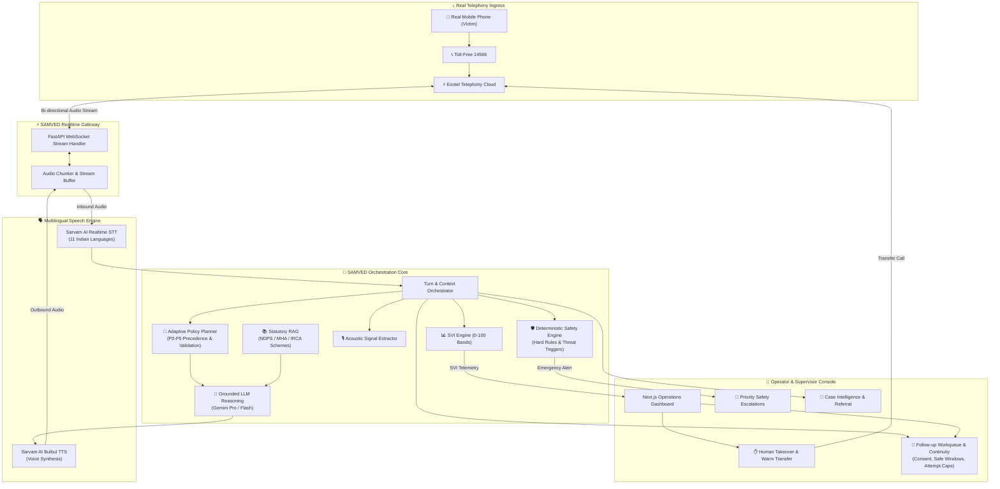

# SAMVED

> **AI-Assisted Multilingual Victim Triage & Response Intelligence for NHAA 14566**
> Smart India Hackathon 2026 | Problem Statement 26093

---

## 1. Product Positioning
**SAMVED is a real-time multilingual AI victim triage platform for NHAA 14566 that uses a live telephone voice agent, contextual NLP, speech-derived signals, deterministic safety detection, explainable SVI, human oversight, and case intelligence to turn a victim's first call into an actionable support pathway.**

---

## 2. Smart India Hackathon 2026 Context
- **Hackathon**: Smart India Hackathon 2026 (SIH 2026)
- **Problem Statement ID**: 26093
- **Domain**: AI-assisted victim vulnerability, crisis triage, and response intelligence
- **Target Institution**: National Toll-Free Drug De-Addiction Helpline (**NHAA 14566**) under the Ministry of Social Justice and Empowerment (MoSJE), Government of India.

---

## 3. What SAMVED Does
When a victim, concerned family member, or at-risk citizen calls the national helpline (14566):
1. **Real Telephony Ingress**: Receives inbound telephone streams via Exotel into the SAMVED Realtime Gateway.
2. **Multilingual Speech Understanding**: Transcribes Hindi, Tamil, Telugu, Kannada, Bengali, Marathi, Gujarati, Malayalam, Punjabi, Odia, or Indian English via Sarvam AI streaming STT.
3. **Contextual Dialogue & Triage**: Conducts empathetic, culturally attuned dialogue to understand the caller's situation and immediate needs.
4. **Deterministic Safety Enforcement**: Evaluates critical safety policies (ongoing violence, acute withdrawal medical distress, self-harm signals) via deterministic rules that cannot be overridden by generative LLMs.
5. **Explainable Stress Vulnerability Index (SVI)**: Computes an operational 0–100 vulnerability score categorized into Low, Moderate, High, or Critical bands with clear contributing factors.
6. **Acoustic Signal Processing**: Analyzes non-verbal speech features (pitch variations, speaking rate, pauses, tremors) as supporting non-diagnostic signals.
7. **Human-in-the-Loop Handover**: Alerts tele-counselors with real-time briefing notes, enabling seamless warm call transfer and human override.
8. **Case Intelligence & Referral Grounding**: Synthesizes longitudinal intake records linked to verified government rehabilitation facilities (IRCAs, de-addiction centers, legal aid clinics).
9. **Follow-up Workflow & Continuity Engine**: Manages human-supervised, consent-verified scheduled check-ins, referrals, and care continuity with safe contact windows, attempt caps, bounded recurrence, and zero autonomous robot-dialing.
10. **District Intelligence & Operational Analytics**: Provides aggregated, privacy-preserving operational analytics for helpline capacity planners without exposing individual caller data, enforcing K-Anonymity ($k \ge 10$), small-cell suppression, and zero predictive policing.

---

## 4. What SAMVED is NOT
To protect caller safety and maintain strict ethical standards:
- ❌ **NOT a Clinical Diagnosis Tool**: SAMVED does NOT provide psychiatric, psychological, or medical diagnoses of addiction, depression, or PTSD.
- ❌ **NOT an Autonomous Emergency Dispatcher**: SAMVED does NOT independently order police raids, involuntary commitments, or emergency medical dispatches.
- ❌ **NOT an AI Therapist**: SAMVED does NOT conduct unverified automated psychotherapy.
- ❌ **NOT a Replacement for Human Operators**: SAMVED augments human tele-counselors and supervisors; high-stakes decisions mandate human validation.
- ❌ **NOT a Generic Chatbot**: SAMVED is purpose-engineered for real telephone audio streaming, low latency, and statutory helpline protocols.

---

## 5. System Architecture



---

## 6. Operating Modes (`APP_MODE`)
SAMVED introduces three explicit operating modes configured via environment variables:

| Mode | Telephony | Speech (STT/TTS) | LLM | Purpose |
| :--- | :--- | :--- | :--- | :--- |
| **`DEV`** | `MockTelephonyProvider` | `MockSpeechToTextProvider` | `MockLLMProvider` | Local feature work without credentials, API expenses, or external dependencies. |
| **`SIMULATION`** | Synthetic audio feeds | Replayable synthetic streams | Replay & scenario benchmark | Automated regression tests, load testing, and tele-counselor training. |
| **`LIVE`** | Real Exotel media streams | Live Sarvam streaming API | Google Gemini Pro / Flash | Production helpline operations. |

---

## 7. Technology Stack
- **Frontend / Operator Console**: Next.js 14/15 (App Router), TypeScript, Tailwind CSS, Lucide Icons.
- **Backend API & Gateway**: Python 3.13, FastAPI, Uvicorn, Pydantic v2, Pydantic-Settings, WebSockets.
- **Shared Contracts**: `@samved/schemas` (TypeScript and Pydantic shared models).
- **Telephony**: Exotel Voice Streaming API (Target: Phase 1), Twilio adapter interface.
- **Speech AI**: Sarvam AI Indian-Language STT & TTS (Target: Phase 2).
- **LLM Reasoning**: Google Gemini Pro & Flash (Vertex AI / Google AI Studio).
- **Data Persistence**: PostgreSQL 16 (`pgvector` prepared), Redis 7 (real-time session state).
- **Testing & QA**: Pytest, Pytest-Asyncio, HTTPX, Playwright Browser Automation.
- **DevOps & CI/CD**: Docker, Docker Compose, GitHub Actions.

---

## 8. Repository Structure
```
samved/
├── apps/
│   ├── web/                     # Next.js Operator/Admin Console
│   └── api/                     # FastAPI Realtime WebSocket & REST API
├── services/
│   ├── voice-gateway/           # Telephony streaming & audio bridging
│   ├── conversation/            # State machine & dialogue management
│   ├── safety-engine/           # Deterministic rules & threat detection
│   ├── risk-engine/             # SVI calculation (0-100 bands)
│   ├── acoustic-engine/         # Paralinguistic feature extraction
│   ├── agent-orchestrator/      # Bounded multi-agent coordination
│   ├── rag-service/             # Grounded statutory and scheme retrieval
│   ├── case-service/            # Anonymous case timeline & record storage
│   └── evaluation/              # Synthetic benchmarking & shadow metrics
├── packages/
│   ├── schemas/                 # Canonical TypeScript & Pydantic contracts
│   └── config/                  # Shared thresholds, languages, and constants
├── knowledge-base/              # Verified NDPS, Mental Health, & IRCA sources
├── scenarios/                   # Synthetic benchmark scenario fixtures
├── infra/                       # Docker, database schemas, and compose
├── docs/                        # Comprehensive technical documentation
├── tests/                       # Integration, fixtures, and E2E specs
├── .github/workflows/           # GitHub Actions CI workflow
├── docker-compose.yml           # Local multi-service development stack
└── pnpm-workspace.yaml          # Monorepo workspace configuration
```

---

## 9. Local Developer Setup

### Prerequisites
- Node.js 22 (`node --version`)
- pnpm 10 (`pnpm --version`)
- Python 3.13 (`python --version`) with `uv` (`uv --version`)
- Git (`git --version`)

### Step 1: Clone Repository
```bash
git clone https://github.com/Balashanmugam30/samved.git
cd samved
```

### Step 2: Configure Environment
```bash
cp .env.example .env
```

### Step 3: Install Node Packages
```bash
pnpm install
```

### Step 4: Setup Python Backend Environment
```bash
cd apps/api
uv venv
uv pip install -r requirements.txt
cd ../..
```

### Step 5: Start Services
```bash
# Terminal 1 — Start FastAPI Backend (Port 8000)
pnpm dev:api

# Terminal 2 — Start Next.js Web Console (Port 3000)
pnpm dev:web
```

---

## 10. Development & Testing Commands

| Task | Command | Description |
| :--- | :--- | :--- |
| **Backend Tests** | `uv --directory apps/api run pytest -v` | Runs 336 unit, integration, safety, SVI, acoustic, adaptive, operator, orchestration, knowledge RAG, case intelligence, follow-up, and district analytics tests |
| **District Analytics Tests**| `uv --directory apps/api run pytest -k analytics -v` | Validates K-Anonymity ($k \ge 10$), small-cell suppression, complementary difference-attack defense, deterministic trends, and access controls |
| **Follow-up Tests** | `uv --directory apps/api run pytest tests/test_followup_*.py -v` | Validates consent FSM, safe windows, bounded recurrence, attempt caps, idempotency, audit trail, concurrency, and security |
| **Contract Flow Test** | `uv --directory apps/api run pytest tests/test_contract_flow.py -v` | Validates end-to-end event schema transport |
| **Case Intelligence Tests**| `uv --directory apps/api run pytest tests/test_case_*.py -v` | Validates entity extraction, relationships, candidates, SHA-256 provenance, temporal logic, and security |
| **Knowledge RAG Tests**| `uv --directory apps/api run pytest tests/test_knowledge_*.py -v` | Validates governed retrieval, versioning, chunking, citations, conflicts, and SSRF defenses |
| **Operator Tests** | `uv --directory apps/api run pytest tests/test_operator_*.py -v` | Validates workstation actions, handoff lifecycle, notes with citations, and audit logging |
| **Safety Tests** | `uv --directory apps/api run pytest tests/test_safety_*.py -v` | Validates deterministic safety engine rules and concurrency |
| **SVI Tests** | `uv --directory apps/api run pytest tests/test_svi_*.py -v` | Validates explainable Stress Vulnerability Index and bounds |
| **Acoustic Tests** | `uv --directory apps/api run pytest tests/test_acoustic_*.py -v` | Validates paralinguistic acoustic signal extraction |
| **Adaptive Tests** | `uv --directory apps/api run pytest tests/test_adaptive_*.py -v` | Validates deterministic conversational policy and overrides |
| **Frontend Type Check** | `pnpm type-check` | Type-checks all TypeScript packages & web app |
| **Frontend Build** | `pnpm build` | Compiles production Next.js web application |
| **Playwright E2E** | `pnpm --filter @samved/web test:e2e` | Runs 150 browser E2E tests (Desktop + Mobile Chrome across all 13 phases including 22 analytics tests) |
| **Telephony Diagnostics** | `curl http://localhost:8000/v1/telephony/doctor` | Safe credential and public ingress check without secrets |
| **Docker Compose** | `docker compose up -d` | Starts PostgreSQL, Redis, API, and Web containers |

---

## 11. Safety, Ethics & Data Limitations
1. **Deterministic Safeguards**: Critical safety triggers (self-harm, ongoing violence) are governed by auditable rules. LLMs do not have unilateral escalation authority.
2. **Epistemic Boundaries**: The Case Intelligence graph models reported dialogue and evidence, **not** objective truth, guilt, or legal culpability. Punitive/criminal labels are rejected or normalized to `REPORTED_ACTOR` with `claim_status = REPORTED`.
3. **Human Oversight**: Tele-counselors maintain real-time supervision, can override any AI recommendation, and must confirm candidate relationships before graduation to active graph edges.
4. **Data Limitations**: Benchmark and public datasets used during development are for technical evaluation only; they do not represent clinical ground truth.
5. **Confidentiality & Provenance**: Caller phone numbers are masked (`+91******3210`), raw audio is ephemeral, secrets are strictly excluded from source control, and all case entities are cryptographically anchored by SHA-256 evidence hashes.
6. **Care Continuity & Consent Boundaries**: Follow-up contacts mandate explicit, non-inferred consent (`EXPLICIT_VERBAL` or `EXPLICIT_WRITTEN`) and are strictly human-telecounselor-initiated. Autonomous robot-calling is architecturally prohibited. Revocation immediately halts all pending contact (`BLOCKED`), and caller-specified safe contact windows (e.g. `09:00-12:00`) are strictly enforced.
7. **Non-Predictive Operational Analytics**: District Intelligence is strictly macro operational analytics for capacity and staffing. It does NOT generate predictive crime scores, neighborhood danger indices, offender rankings, or individual risk predictions. Autonomous police or emergency dispatch is architecturally prohibited.

---

## 12. Implementation Status (Phase 13 Complete)

| Capability / Module | Status | Phase Owner |
| :--- | :---: | :--- |
| **Repository Monorepo Foundation** | ✅ | Phase 0 |
| **FastAPI Backend (`/health`, `/ready`, `/version`)** | ✅ | Phase 0 |
| **Realtime WebSocket Gateway (`/ws`)** | ✅ | Phase 0 |
| **Event Taxonomy & Envelopes (v1.0)** | ✅ | Phase 0 |
| **Provider Abstraction Layer & Mocks** | ✅ | Phase 0 |
| **Next.js Web Console & Operational Status Panel** | ✅ | Phase 0 |
| **Playwright Browser Smoke Tests** | ✅ | Phase 0 |
| **CI/CD Pipeline (GitHub Actions)** | ✅ | Phase 0 |
| **Exotel Provider Adapter (`ExotelTelephonyProvider`)** | ✅ | Phase 1 |
| **Inbound Call Webhook (`/v1/telephony/exotel/inbound`)** | ✅ | Phase 1 |
| **Call State Machine (`NEW` -> `STREAMING` -> `ENDED`)** | ✅ | Phase 1 |
| **Realtime Telephony Gateway (`/ws/telephony/exotel`)** | ✅ | Phase 1 |
| **Realtime Session Manager & Audio Framing (8kHz PCM)** | ✅ | Phase 1 |
| **Telephony Simulator & Ingress Test Harness** | ✅ | Phase 1 |
| **Telephony Diagnostics & Live Operator View (`/calls`)** | ✅ | Phase 1 |
| **Sarvam Realtime Streaming STT (`saaras:v3`)** | ✅ | Phase 2 |
| **Gemini Conversational Intelligence (`gemini-2.5-flash`)** | ✅ | Phase 2 |
| **Sarvam Bulbul TTS (`bulbul:v3`) & 8kHz WAV Stripping** | ✅ | Phase 2 |
| **Turn Coordination & Orchestration State Machine** | ✅ | Phase 2 |
| **Barge-In / Caller Interruption Engine** | ✅ | Phase 2 |
| **Multilingual Voice Simulation Harness (Tamil/Hindi/English)** | ✅ | Phase 2 |
| **Dedicated Operator WebSocket (`/ws/operator`)** | ✅ | Phase 3 |
| **Operator Dynamic Subscription & Isolation (`SUBSCRIBE_CALL`)** | ✅ | Phase 3 |
| **REST Snapshot APIs (`/v1/calls`, `/transcript`, `/events`)** | ✅ | Phase 3 |
| **Master-Detail Operator Console (`/calls`, Filters, Inspector)** | ✅ | Phase 3 |
| **Localhost Runbook & Manual Verification Report** | ✅ | Phase 3 |
| **Live External Telephony / Cloud Provider Access** | ⚠️ Blocked by External Credentials | Phase 1 & 2 |
| **Deterministic Safety Engine (Sub-5ms, Offline, Explainable)** | ✅ | Phase 4 |
| **Versioned Safety Rules (v1: Threats, Weapons, Self-Harm, Confinement)** | ✅ | Phase 4 |
| **Operator Safety Oversight Banner & Immutable Audit Acknowledgment** | ✅ | Phase 4 |
| **Stress Vulnerability Index (SVI 0–100 Bands)** | ✅ | Phase 5 |
| **Deterministic SVI Engine (Sub-5ms, Offline, Explainable)** | ✅ | Phase 5 |
| **Versioned SVI Weights & Multilingual Lexicons (en-IN, ta-IN, hi-IN)** | ✅ | Phase 5 |
| **Operator SVI Panel, Feature Attribution & Turn History** | ✅ | Phase 5 |
| **Interactive SVI Simulation Lab** | ✅ | Phase 5 |
| **Acoustic Paralinguistic Feature Extraction & Signal Layer** | ✅ | Phase 6 |
| **Operator Acoustic Signals Panel & Simulation Lab** | ✅ | Phase 6 |
| **Acoustic REST APIs (`/v1/acoustic/...`) & Realtime Ingress** | ✅ | Phase 6 |
| **Adaptive Multilingual Conversation Policy (P0–P5, Validator)** | ✅ | Phase 7 |
| **Adaptive Panel, Operator Overrides & Trajectory History** | ✅ | Phase 7 |
| **Human Operator Console & Tele-Counselor Workstation** | ✅ | Phase 8 |
| **Unified Call Triage Summary (6 Dimensions + Non-Clinical Disclaimer)** | ✅ | Phase 8 & 9 |
| **Operator Takeover, Pause/Resume, Safety Check & End Call Controls** | ✅ | Phase 8 |
| **Multi-Stage Counselor Handoff Lifecycle & Confirmation Guard** | ✅ | Phase 8 |
| **Append-Only Structured Operator Notes & Auditable Timeline** | ✅ | Phase 8 |
| **Multi-Agent Orchestration & Deterministic Stage Coordination** | ✅ | Phase 9 |
| **Specialized AI Worker Taxonomy (6 Bounded Agents & Phase 10 Stub)** | ✅ | Phase 9 |
| **Operator Briefing Card & Realtime Multi-Agent Oversight Panel** | ✅ | Phase 9 |
| **Orchestration REST APIs (`/v1/orchestration/...`) & Audit Trail** | ✅ | Phase 9 |
| **Legal / Policy RAG Subsystem (Tier 1–4 Governed Retrieval)** | ✅ | Phase 10 |
| **Multi-Version Document Tree & Temporal Applicability (`as_of_date`)** | ✅ | Phase 10 |
| **Context-Preserving Hierarchical Chunking & Qualifier Retention** | ✅ | Phase 10 |
| **Cryptographic Citation Integrity & Verbatim Hash Verification** | ✅ | Phase 10 |
| **Deterministic Conflict Detection & Statutory Precedence** | ✅ | Phase 10 |
| **Prompt Injection Delimiters (`<retrieved_source_data>`) & SSRF Defense** | ✅ | Phase 10 |
| **Operator Knowledge Support Panel, Conflict/Stale Banners & Note Ref** | ✅ | Phase 10 |
| **Knowledge REST APIs (`/v1/knowledge/...`) & Audit Trail** | ✅ | Phase 10 |
| **Case Intelligence & Knowledge Graph Subsystem** | ✅ | Phase 11 |
| **Explainable Entity/Relationship Layer & Role Normalization** | ✅ | Phase 11 |
| **Cryptographic Provenance Anchors (SHA-256 Verbatim Excerpt Hashes)** | ✅ | Phase 11 |
| **Bitemporal Validity Intervals & Non-Destructive Supersession** | ✅ | Phase 11 |
| **Human Tele-Counselor Candidate Confirmation/Rejection Guard** | ✅ | Phase 11 |
| **Operator Case Intelligence Panel, Graph Visualizer & Inspectors** | ✅ | Phase 11 |
| **Case Graph REST APIs (`/v1/cases/...`) & Immutable Mutation Audit** | ✅ | Phase 11 |
| **Follow-up & Care Continuity Engine** | ✅ | Phase 12 |
| **Consent State Machine & Revocation Cascade (`EXPLICIT` -> `REVOKED`)** | ✅ | Phase 12 |
| **Safe Contact Window & Bounded Recurrence Engine** | ✅ | Phase 12 |
| **Human-Initiated Execution Guard (Zero Autonomous Robot-Dialing)** | ✅ | Phase 12 |
| **Deterministic Policy Checks (Purpose, SVI Supremacy, Attempt Caps)** | ✅ | Phase 12 |
| **Operator Follow-up Workqueue, Create Modal & Execution Drawer** | ✅ | Phase 12 |
| **Follow-up REST APIs (`/v1/followups/...`) & Cryptographic Audit Trail** | ✅ | Phase 12 |
| **District Intelligence & Operational Analytics** | ✅ | Phase 13 |
| **K-Anonymity & Small-Cell Suppression Engine (k >= 10)** | ✅ | Phase 13 |
| **Difference Attack & Complementary Suppression Defense** | ✅ | Phase 13 |
| **Trust Classification Model (OBSERVED, CALCULATED, ESTIMATED)** | ✅ | Phase 13 |
| **Deterministic Period-over-Period Trends (No Predictive AI)** | ✅ | Phase 13 |
| **Role-Governed Dashboard & Metric Inspector Drawer** | ✅ | Phase 13 |
| **Analytics REST APIs (`/v1/analytics/...`) & Access Audit** | ✅ | Phase 13 |
| **Scenario Simulation Engine** | ⏳ | Phase 14 |

---

## 13. Security & Contributing
- For security policies and vulnerability reporting, see [SECURITY.md](SECURITY.md).
- For coding standards and contribution guidelines, see [CONTRIBUTING.md](CONTRIBUTING.md).

---

## 14. License
This project is licensed under the Apache License 2.0. See [LICENSE](LICENSE) for details.
