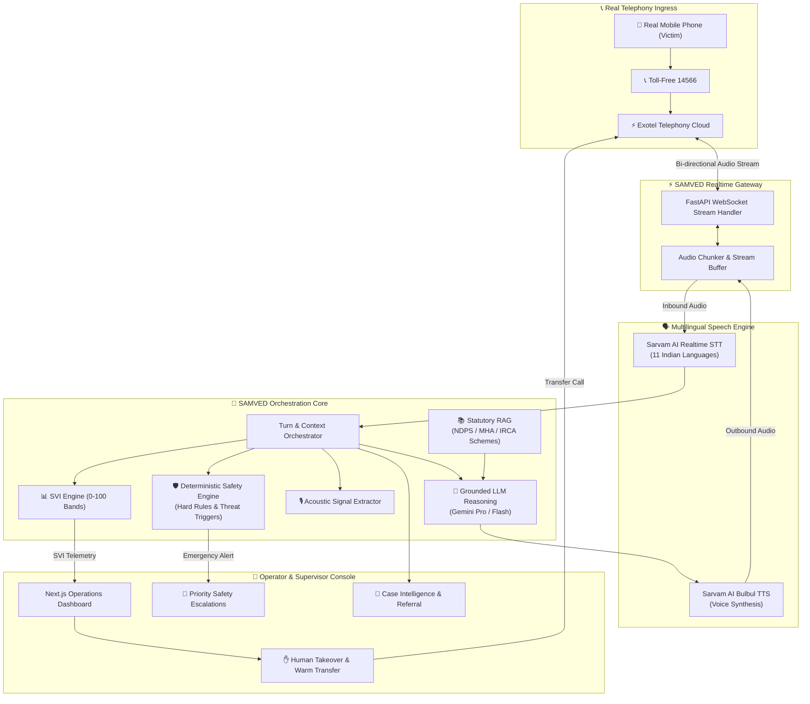

# SAMVED

> **AI-Assisted Multilingual Victim Triage & Response Intelligence for NHAA 14566**
> Smart India Hackathon 2026 | Problem Statement 26093

---

## 1. Product Positioning
**SAMVED is a real-time multilingual AI victim triage platform for NHAA 14566 that uses a live telephone voice agent, contextual NLP, speech-derived signals, deterministic safety detection, explainable SVI, human oversight, and case intelligence to turn a victim's first call into an actionable support pathway.**

---

## 2. Smart India Hackathon 2026 Context
- **Hackathon**: Smart India Hackathon 2026 (SIH 2026)
- **Problem Statement ID**: 26093
- **Domain**: AI-assisted victim vulnerability, crisis triage, and response intelligence
- **Target Institution**: National Toll-Free Drug De-Addiction Helpline (**NHAA 14566**) under the Ministry of Social Justice and Empowerment (MoSJE), Government of India.

---

## 3. What SAMVED Does
When a victim, concerned family member, or at-risk citizen calls the national helpline (14566):
1. **Real Telephony Ingress**: Receives inbound telephone streams via Exotel into the SAMVED Realtime Gateway.
2. **Multilingual Speech Understanding**: Transcribes Hindi, Tamil, Telugu, Kannada, Bengali, Marathi, Gujarati, Malayalam, Punjabi, Odia, or Indian English via Sarvam AI streaming STT.
3. **Contextual Dialogue & Triage**: Conducts empathetic, culturally attuned dialogue to understand the caller's situation and immediate needs.
4. **Deterministic Safety Enforcement**: Evaluates critical safety policies (ongoing violence, acute withdrawal medical distress, self-harm signals) via deterministic rules that cannot be overridden by generative LLMs.
5. **Explainable Stress Vulnerability Index (SVI)**: Computes an operational 0–100 vulnerability score categorized into Low, Moderate, High, or Critical bands with clear contributing factors.
6. **Acoustic Signal Processing**: Analyzes non-verbal speech features (pitch variations, speaking rate, pauses, tremors) as supporting non-diagnostic signals.
7. **Human-in-the-Loop Handover**: Alerts tele-counselors with real-time briefing notes, enabling seamless warm call transfer and human override.
8. **Case Intelligence & Referral Grounding**: Synthesizes longitudinal intake records linked to verified government rehabilitation facilities (IRCAs, de-addiction centers, legal aid clinics).

---

## 4. What SAMVED is NOT
To protect caller safety and maintain strict ethical standards:
- ❌ **NOT a Clinical Diagnosis Tool**: SAMVED does NOT provide psychiatric, psychological, or medical diagnoses of addiction, depression, or PTSD.
- ❌ **NOT an Autonomous Emergency Dispatcher**: SAMVED does NOT independently order police raids, involuntary commitments, or emergency medical dispatches.
- ❌ **NOT an AI Therapist**: SAMVED does NOT conduct unverified automated psychotherapy.
- ❌ **NOT a Replacement for Human Operators**: SAMVED augments human tele-counselors and supervisors; high-stakes decisions mandate human validation.
- ❌ **NOT a Generic Chatbot**: SAMVED is purpose-engineered for real telephone audio streaming, low latency, and statutory helpline protocols.

---

## 5. System Architecture



---

## 6. Operating Modes (`APP_MODE`)
SAMVED introduces three explicit operating modes configured via environment variables:

| Mode | Telephony | Speech (STT/TTS) | LLM | Purpose |
| :--- | :--- | :--- | :--- | :--- |
| **`DEV`** | `MockTelephonyProvider` | `MockSpeechToTextProvider` | `MockLLMProvider` | Local feature work without credentials, API expenses, or external dependencies. |
| **`SIMULATION`** | Synthetic audio feeds | Replayable synthetic streams | Replay & scenario benchmark | Automated regression tests, load testing, and tele-counselor training. |
| **`LIVE`** | Real Exotel media streams | Live Sarvam streaming API | Google Gemini Pro / Flash | Production helpline operations. |

---

## 7. Technology Stack
- **Frontend / Operator Console**: Next.js 14/15 (App Router), TypeScript, Tailwind CSS, Lucide Icons.
- **Backend API & Gateway**: Python 3.13, FastAPI, Uvicorn, Pydantic v2, Pydantic-Settings, WebSockets.
- **Shared Contracts**: `@samved/schemas` (TypeScript and Pydantic shared models).
- **Telephony**: Exotel Voice Streaming API (Target: Phase 1), Twilio adapter interface.
- **Speech AI**: Sarvam AI Indian-Language STT & TTS (Target: Phase 2).
- **LLM Reasoning**: Google Gemini Pro & Flash (Vertex AI / Google AI Studio).
- **Data Persistence**: PostgreSQL 16 (`pgvector` prepared), Redis 7 (real-time session state).
- **Testing & QA**: Pytest, Pytest-Asyncio, HTTPX, Playwright Browser Automation.
- **DevOps & CI/CD**: Docker, Docker Compose, GitHub Actions.

---

## 8. Repository Structure
```
samved/
├── apps/
│   ├── web/                     # Next.js Operator/Admin Console
│   └── api/                     # FastAPI Realtime WebSocket & REST API
├── services/
│   ├── voice-gateway/           # Telephony streaming & audio bridging
│   ├── conversation/            # State machine & dialogue management
│   ├── safety-engine/           # Deterministic rules & threat detection
│   ├── risk-engine/             # SVI calculation (0-100 bands)
│   ├── acoustic-engine/         # Paralinguistic feature extraction
│   ├── agent-orchestrator/      # Bounded multi-agent coordination
│   ├── rag-service/             # Grounded statutory and scheme retrieval
│   ├── case-service/            # Anonymous case timeline & record storage
│   └── evaluation/              # Synthetic benchmarking & shadow metrics
├── packages/
│   ├── schemas/                 # Canonical TypeScript & Pydantic contracts
│   └── config/                  # Shared thresholds, languages, and constants
├── knowledge-base/              # Verified NDPS, Mental Health, & IRCA sources
├── scenarios/                   # Synthetic benchmark scenario fixtures
├── infra/                       # Docker, database schemas, and compose
├── docs/                        # Comprehensive technical documentation
├── tests/                       # Integration, fixtures, and E2E specs
├── .github/workflows/           # GitHub Actions CI workflow
├── docker-compose.yml           # Local multi-service development stack
└── pnpm-workspace.yaml          # Monorepo workspace configuration
```

---

## 9. Local Developer Setup

### Prerequisites
- Node.js 22 (`node --version`)
- pnpm 10 (`pnpm --version`)
- Python 3.13 (`python --version`) with `uv` (`uv --version`)
- Git (`git --version`)

### Step 1: Clone Repository
```bash
git clone https://github.com/Balashanmugam30/samved.git
cd samved
```

### Step 2: Configure Environment
```bash
cp .env.example .env
```

### Step 3: Install Node Packages
```bash
pnpm install
```

### Step 4: Setup Python Backend Environment
```bash
cd apps/api
uv venv
uv pip install -r requirements.txt
cd ../..
```

### Step 5: Start Services
```bash
# Terminal 1 — Start FastAPI Backend (Port 8000)
pnpm dev:api

# Terminal 2 — Start Next.js Web Console (Port 3000)
pnpm dev:web
```

---

## 10. Development & Testing Commands

| Task | Command | Description |
| :--- | :--- | :--- |
| **Backend Tests** | `uv run pytest apps/api/tests -v` | Runs 30 unit, state machine, webhook, concurrency, and contract tests |
| **Contract Flow Test** | `uv run pytest apps/api/tests/test_contract_flow.py -v` | Validates end-to-end event schema transport |
| **Concurrency Test** | `uv run pytest apps/api/tests/test_telephony_concurrency.py -v` | Validates 5 concurrent calls with zero crosstalk |
| **Frontend Type Check** | `pnpm type-check` | Type-checks all TypeScript packages & web app |
| **Frontend Build** | `pnpm build` | Compiles production Next.js web application |
| **Playwright E2E** | `pnpm --filter @samved/web test:e2e` | Runs headless browser smoke tests (Desktop + Mobile) |
| **Telephony Diagnostics** | `curl http://localhost:8000/v1/telephony/doctor` | Safe credential and public ingress check without secrets |
| **Docker Compose** | `docker compose up -d` | Starts PostgreSQL, Redis, API, and Web containers |

---

## 11. Safety, Ethics & Data Limitations
1. **Deterministic Safeguards**: Critical safety triggers (self-harm, ongoing violence) are governed by auditable rules. LLMs do not have unilateral escalation authority.
2. **Human Oversight**: Tele-counselors maintain real-time supervision and can override any AI recommendation.
3. **Data Limitations**: Benchmark and public datasets used during development are for technical evaluation only; they do not represent clinical ground truth.
4. **Confidentiality**: Caller phone numbers are masked, raw audio is ephemeral in dev modes, and secrets are strictly excluded from source control.

---

## 12. Implementation Status (Phase 2)

| Capability / Module | Status | Phase Owner |
| :--- | :---: | :--- |
| **Repository Monorepo Foundation** | ✅ | Phase 0 |
| **FastAPI Backend (`/health`, `/ready`, `/version`)** | ✅ | Phase 0 |
| **Realtime WebSocket Gateway (`/ws`)** | ✅ | Phase 0 |
| **Event Taxonomy & Envelopes (v1.0)** | ✅ | Phase 0 |
| **Provider Abstraction Layer & Mocks** | ✅ | Phase 0 |
| **Next.js Web Console & Operational Status Panel** | ✅ | Phase 0 |
| **Playwright Browser Smoke Tests** | ✅ | Phase 0 |
| **CI/CD Pipeline (GitHub Actions)** | ✅ | Phase 0 |
| **Exotel Provider Adapter (`ExotelTelephonyProvider`)** | ✅ | Phase 1 |
| **Inbound Call Webhook (`/v1/telephony/exotel/inbound`)** | ✅ | Phase 1 |
| **Call State Machine (`NEW` -> `STREAMING` -> `ENDED`)** | ✅ | Phase 1 |
| **Realtime Telephony Gateway (`/ws/telephony/exotel`)** | ✅ | Phase 1 |
| **Realtime Session Manager & Audio Framing (8kHz PCM)** | ✅ | Phase 1 |
| **Telephony Simulator & Ingress Test Harness** | ✅ | Phase 1 |
| **Telephony Diagnostics & Live Operator View (`/calls`)** | ✅ | Phase 1 |
| **Sarvam Realtime Streaming STT (`saaras:v3`)** | ✅ | Phase 2 |
| **Gemini Conversational Intelligence (`gemini-2.5-flash`)** | ✅ | Phase 2 |
| **Sarvam Bulbul TTS (`bulbul:v3`) & 8kHz WAV Stripping** | ✅ | Phase 2 |
| **Turn Coordination & Orchestration State Machine** | ✅ | Phase 2 |
| **Barge-In / Caller Interruption Engine** | ✅ | Phase 2 |
| **Multilingual Voice Simulation Harness (Tamil/Hindi/English)** | ✅ | Phase 2 |
| **Live Multi-Turn Transcript & Latency Console** | ✅ | Phase 2 |
| **Live External Telephony / Cloud Provider Access** | ⚠️ Blocked by External Credentials | Phase 1 & 2 |
| **Deterministic Safety Engine** | ⏳ | Phase 4 |
| **Stress Vulnerability Index (SVI 0–100 Bands)** | ⏳ | Phase 5 |
| **Acoustic Paralinguistic Feature Extraction** | ⏳ | Phase 6 |
| **Multi-Agent Orchestrator** | ⏳ | Phase 9 |
| **Statutory & Scheme RAG (NDPS / IRCA)** | ⏳ | Phase 10 |
| **Longitudinal Case Intelligence** | ⏳ | Phase 11 |

---

## 13. Security & Contributing
- For security policies and vulnerability reporting, see [SECURITY.md](SECURITY.md).
- For coding standards and contribution guidelines, see [CONTRIBUTING.md](CONTRIBUTING.md).

---

## 14. License
This project is licensed under the Apache License 2.0. See [LICENSE](LICENSE) for details.
