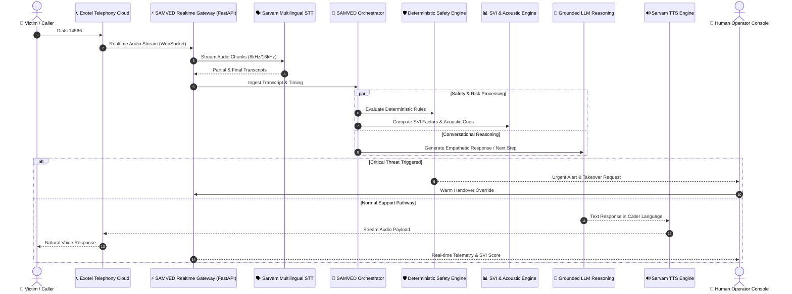

# SAMVED — System Architecture & Design Specification

## 1. System Vision & Domain Context
SAMVED is an AI-assisted multilingual victim triage, risk evaluation, and response intelligence layer tailored specifically for the National Toll-Free Drug De-Addiction Helpline (**NHAA 14566**), answering Smart India Hackathon 2026 Problem Statement **26093**.

### Non-Negotiable Invariants
- **Real Telephony Priority**: The caller's interface is fundamentally a real mobile phone dialing 14566. Browser microphones are for developer debugging only.
- **Deterministic Safety**: The safety engine strictly enforces deterministic policies. Generative LLMs do not possess autonomous escalation or emergency dispatch authority.
- **Non-Diagnostic**: The Stress Vulnerability Index (SVI) and acoustic signal processing provide operational triage support to assist human tele-counselors, never psychiatric or clinical diagnoses.
- **Human-in-the-Loop**: All critical interventions, case referrals, and statutory reports mandate human operator validation and provide full override capability.

---

## 2. End-to-End Telephony Call Flow



---

## 3. Monorepo Structural Boundaries

```
samved/
├── apps/
│   ├── web/                     # Next.js 14/15 Operator/Admin Console
│   └── api/                     # FastAPI Realtime WebSocket & REST API
├── services/
│   ├── voice-gateway/           # Telephony streaming & audio bridging
│   ├── conversation/            # State machine & dialogue management
│   ├── safety-engine/           # Deterministic rules & threat detection
│   ├── risk-engine/             # SVI calculation (0-100 bands)
│   ├── acoustic-engine/         # Paralinguistic feature extraction
│   ├── agent-orchestrator/      # Bounded multi-agent coordination
│   ├── rag-service/             # Grounded statutory and scheme retrieval
│   ├── case-service/            # Anonymous case timeline & record storage
│   └── evaluation/              # Synthetic benchmarking & shadow metrics
├── packages/
│   ├── schemas/                 # Canonical TypeScript & Pydantic contracts
│   └── config/                  # Shared thresholds, languages, and constants
├── knowledge-base/              # Verified NDPS, Mental Health, & IRCA sources
├── scenarios/                   # Synthetic benchmark scenario fixtures
├── infra/                       # Docker, database schemas, and compose
└── docs/                        # Comprehensive technical documentation
```

---

## 4. Operating Modes (`APP_MODE`)

| Mode | Telephony Integration | Speech (STT/TTS) | LLM Reasoning | Database | Use Case |
| :--- | :--- | :--- | :--- | :--- | :--- |
| **`DEV`** | `MockTelephonyProvider` | `MockSpeechToTextProvider` | `MockLLMProvider` | Local Postgres / SQLite | Safe local feature development without incurring provider costs or requiring credentials |
| **`SIMULATION`** | Synthetic audio feed | Synthetic streaming | Scenario replay | Local Postgres | Automated regression testing, load benchmarking, and training simulations |
| **`LIVE`** | Real Exotel media stream | Sarvam Streaming STT/TTS | Google Gemini Pro / Flash | Managed PostgreSQL (`pgvector`) | Production deployment with real helpline callers |
