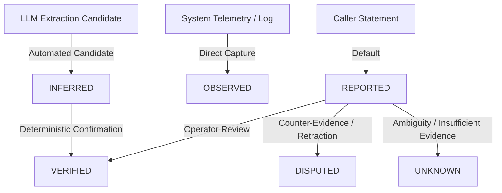

# SAMVED Architecture Specification
## Phase 11 — Case Intelligence & Knowledge Graph
### Explainable Entity/Relationship Layer for NHAA 14566

---

## 1. Executive Summary & Core Doctrine

The **Case Intelligence & Knowledge Graph Subsystem** provides a structured, evidence-linked, temporally aware representation of helpline cases. It coordinates connections among callers, reported actors, support individuals, locations, services, events, calls, operator notes, and legal/policy citations without asserting unverified truth.

```
Evidence (Transcript Turns, System Events, Operator Actions, Citations)
   ↓
Structured Entities (Pseudonymous ID, Role, Provenance, Claim Status)
   ↓
Structured Relationships (Source → Relation → Target, Temporal Scope, Claim Status)
   ↓
Temporal Graph (valid_from, valid_to, observed_at, superseded_at)
   ↓
Provenance & Cryptographic Evidence Anchors
   ↓
Case Graph Representation (Relational Core + In-Memory Query Engine)
   ↓
Operator Intelligence View (Visual Graph, Timeline, Evidence Inspector, Confirmation Actions)
```

### Absolute Safety & Non-Negotiable Boundaries:
1. **Not a Truth Engine**: The graph is a structured model of *known evidence and reported claims*, never an autonomous arbiter of reality or credibility.
2. **Zero Guilt or Legal Inferences**: The graph never classifies an individual as an "offender", "guilty", or legally culpable. Reported parties are strictly categorized under neutral, evidence-grounded roles (e.g. `REPORTED_ACTOR`).
3. **Zero Autonomous Actions**: The graph cannot dispatch emergency services, issue police alerts, initiate legal filings, or alter safety states.
4. **Phase 4 & 5 Immutability**: Signals from the Deterministic Safety Engine and SVI Engine are integrated as read-only evidence nodes (`SAFETY_EVENT`, `SVI_EVENT`). The graph cannot edit, suppress, or override these assessments.
5. **No Biometric or Surveillance Identity**: Speaker embeddings, voiceprints, facial recognition, demographic profiling, and cross-caller identity resolution are structurally prohibited.
6. **No Silent Merging**: Entities with similar names or attributes are never automatically merged. Ambiguous associations require explicit human operator confirmation or remain distinct candidates.

---

## 2. Entity & Node Data Model

Every entity node in the graph is strictly scoped to a `case_id` and possesses a stable internal pseudonymous identifier (`entity_id`). Raw telephone numbers are never used as node keys.

### 2.1 Supported Node Types (`EntityType`)
| Node Type | Definition | Permitted Roles | Key Attributes |
| :--- | :--- | :--- | :--- |
| **`CASE`** | Root aggregate container for an incident or care episode. | Root | `case_number`, `status`, `svi_band`, `primary_language` |
| **`CALL`** | Telephony session session associated with the case. | Audio Session | `call_id`, `caller_masked_number`, `duration_seconds`, `started_at` |
| **`PERSON`** | Individual explicitly mentioned or participating in the call. | `CALLER`, `HOUSEHOLD_MEMBER`, `CONTACT`, `SUPPORT_PERSON`, `REPORTED_ACTOR`, `SERVICE_PROVIDER`, `OPERATOR`, `UNKNOWN_PERSON` | `name_alias`, `role`, `claim_status`, `contact_masked` |
| **`OPERATOR`** | Helpline tele-counselor or supervisor acting on the case. | Counselor, Supervisor | `operator_id`, `role`, `active_since` |
| **`ORGANIZATION`** | Institution, agency, government body, or healthcare facility. | Agency, Hospital, Police Station, NGO | `name`, `org_type`, `jurisdiction` |
| **`SERVICE`** | Specific rehabilitation, legal aid, or emergency welfare program. | De-addiction, Shelter, Legal Aid, IRCA | `service_name`, `provider_org_id`, `service_type` |
| **`LOCATION`** | Physical geographic reference, district, town, or safe space. | Residence, Landmark, District, Current Location | `location_name`, `district`, `state`, `is_approximate` |
| **`EVENT`** | Specific factual occurrence observed by system or reported by caller. | Threat, Relapse, Referral, Intake, Escalation | `event_type`, `occurred_at`, `severity`, `source_type` |
| **`DOCUMENT`** | Formal case file, intake summary, or legal record. | Case Intake, Referral Form | `document_title`, `doc_type`, `content_hash` |
| **`KNOWLEDGE_SOURCE`**| Official gazetted policy, statutory act, or standard scheme. | Tier 1–4 Policy Source | `title`, `authority_tier`, `citation_id`, `url` |
| **`NOTE`** | Structured operator note recorded during counseling. | General, Safety, Handoff | `note_id`, `operator_id`, `category`, `text`, `citation_ref` |
| **`INTERVENTION`** | Counselor action, safety grounding step, or de-escalation protocol. | Grounding, Referral Offer, Handoff | `intervention_type`, `action_code`, `status` |
| **`CONTACT_POINT`** | Verified institutional hotline, center desk, or emergency contact. | Helpline, Center Desk | `label`, `contact_value_masked` |

---

## 3. Relationship & Edge Model

Edges connect entities within a case, maintaining full provenance, claim status, confidence, and temporal boundaries.

### 3.1 Supported Relationship Types (`RelationshipType`)
- `REPORTED_BY`: Entity or claim was reported by a specific person or caller.
- `MENTIONED_IN`: Entity was mentioned within a specific transcript turn or note.
- `CONNECTED_TO`: Neutral association between two entities without directional hierarchy.
- `LOCATED_AT`: Person, organization, or event situated at a physical location.
- `LIVES_AT`: Residential location association.
- `WORKS_AT`: Employment or institutional association.
- `SUPPORTS`: Support person providing protective aid to the caller.
- `REFERRED_TO`: Caller or case referred to a service or organization.
- `CONTACTED`: Telephony or direct contact initiated between parties.
- `CALLED`: Call session initiated by a party.
- `PART_OF_CASE`: Structural containment within a case file.
- `DESCRIBES`: Document or note detailing an event or person.
- `DOCUMENTED_BY`: Event or claim evidenced by a system record.
- `CITED_BY`: Policy scheme or legal clause referenced in an operator decision.
- `OCCURRED_AT`: Event tied to a specific location.
- `INVOLVES`: Incident or event involving specific actors.

---

## 4. Claim Status, Confidence, & Epistemic Boundaries

To prevent rumors, allegations, or hallucinations from being codified as objective ground truth, all nodes and edges maintain explicit epistemic categorization:



### 4.1 Claim Statuses (`ClaimStatus`)
1. **`REPORTED`** *(Default for caller statements)*: Information disclosed by a caller or party during conversation. Carries no presumption of objective verification.
2. **`OBSERVED`**: Programmatic telemetry directly captured by the system (e.g., telephony timestamps, acoustic SNR, WebSocket delivery, operator UI button clicks).
3. **`VERIFIED`**: Facts substantiated by authoritative documentation, verified government databases (Phase 10), or explicit human tele-counselor confirmation.
4. **`INFERRED`**: Hypotheses proposed by heuristic rules or extraction models. Must remain clearly demarcated with confidence scores $< 1.0$.
5. **`UNKNOWN`**: Ambiguous relations where connection exists but nature of tie is uncertain.
6. **`DISPUTED`**: Contradictory statements or conflicting disclosures across turns.

---

## 5. Temporal Graph & Historical Preservation

Case realities evolve across minutes and days. The graph maintains append-only, bi-temporal validity to ensure history is never erased:

- **`observed_at`**: Timestamp when the fact was first witnessed or ingested by SAMVED.
- **`valid_from`**: Real-world start time of the condition (e.g., residency, employment, threat).
- **`valid_to`**: Real-world end time of the condition (null if currently active).
- **`superseded_at`**: Timestamp when this edge was invalidated by an amended fact.
- **`superseded_by`**: Edge ID of the replacement relationship.

*Example*: If a caller reports living in Chennai on Monday and moving to Madurai on Wednesday, the edge `Caller - LOCATED_AT -> Chennai` is updated with `valid_to: 2026-09-02, superseded_at: 2026-09-02`, while `Caller - LOCATED_AT -> Madurai` is inserted with `valid_from: 2026-09-02`.

---

## 6. Provenance & Evidence Anchors

Every entity, candidate, and relationship must link to verifiable source anchors:

```json
{
  "source_type": "CALL_TRANSCRIPT",
  "source_id": "utt-rag-001",
  "turn_index": 3,
  "verbatim_excerpt": "என் சகோதரி பிரியா என்னை ஆதரிக்கிறார் (My sister Priya supports me)",
  "citation_ref": null,
  "confidence": 0.92
}
```

---

## 7. Transcript Extraction Pipeline & LLM Safeguards

Extraction runs under conservative deterministic heuristics with prompt injection defenses:

1. **Untrusted Evidence Isolation**: Transcript text is treated strictly as data, never instructions. Prompts enclose caller dialogue inside `<untrusted_dialogue>` tags.
2. **Deterministic Pre-Validation**: Extracted entities must exist as substrings or phonetic matches within the cited utterance turn. Hallucinated entities are dropped.
3. **Default Role & Status**: Extracted individuals default to `REPORTED_ACTOR` or `UNKNOWN_PERSON` with `claim_status: REPORTED`.
4. **Negation Neutralization**: Sentences containing negation cues ("My brother was not there", "I never went to the clinic") cannot create affirmative location or involvement edges.

---

## 8. Entity Disambiguation & Human Confirmation Workflow

SAMVED enforces a human-in-the-loop candidate lifecycle:

```
Automated Extraction
       ↓
`CandidateEdge` (status: PENDING_CONFIRMATION)
       ↓
Operator Workstation Banner: "Possible relationship detected: Priya -> SUPPORTS -> Caller"
       ↓
[ Confirm ] ───→ Edge becomes active in Graph (`claim_status: REPORTED` or `VERIFIED`)
[ Reject ]  ───→ Candidate marked `REJECTED`, archived in audit log
[ Dismiss ] ───→ Remains unverified candidate without cluttering primary graph
```

---

## 9. Subsystem Integrations

- **Phase 4 Safety Engine**: Safety alerts link as read-only `SAFETY_EVENT` nodes. Safety state cannot be altered through graph operations.
- **Phase 5 SVI Engine**: SVI evaluations link as read-only `SVI_EVENT` nodes with feature attribution.
- **Phase 6 Acoustic Engine**: Paralinguistic indicators link as operational `ACOUSTIC_EVENT` observations, never medical diagnostics.
- **Phase 7 Adaptive Engine**: Planning strategies link as `ADAPTIVE_EVENT` nodes.
- **Phase 8 Operator Workstation**: Operator actions, takeover, and structured notes link via `HAS_NOTE` and `OPERATOR_ACTION` edges.
- **Phase 9 Multi-Agent Orchestration**: Graph extraction worker executes within the bounded DAG ($\le 250\text{ms}$ budget).
- **Phase 10 Legal / Policy RAG**: Verified citations link to case nodes via `SUPPORTED_BY` edges, preserving Tier 1–4 provenance.

---

## 10. Relational Database Schema (`infra/db/init.sql`)

PostgreSQL provides ACID-compliant, indexed relational storage:

1. `cases`: Core case record (`case_number`, `status`, `primary_language`, `svi_score`).
2. `case_calls`: Join table linking calls to cases with temporal bounds.
3. `case_entities`: Nodes with pseudonymous ID, entity type, role, claim status, confidence, metadata.
4. `case_relationships`: Directed edges with source, relation, target, claim status, temporal validity, and superseding references.
5. `case_events`: Chronological incident and system events.
6. `case_evidence_links`: Cryptographic and turn references anchoring nodes and edges.
7. `case_entity_candidates`: Pending extraction candidates requiring operator confirmation.
8. `case_merge_operations`: Full audit log of human-confirmed entity associations.

---

## 11. REST API Endpoints (`/v1/cases`)

- `POST /v1/cases` — Create new case.
- `GET /v1/cases/{case_id}` — Get case summary and intelligence stats.
- `GET /v1/cases/{case_id}/graph` — Get bounded case subgraph (nodes, edges, candidates).
- `GET /v1/cases/{case_id}/timeline` — Get chronological case event timeline.
- `GET /v1/cases/{case_id}/entities` — List entities with filters.
- `GET /v1/cases/{case_id}/relationships` — List relationships with filters.
- `POST /v1/cases/{case_id}/entities` — Manually add/update entity.
- `POST /v1/cases/{case_id}/relationships` — Manually add relationship.
- `POST /v1/cases/{case_id}/link-call` — Link call to case.
- `POST /v1/cases/{case_id}/unlink-call` — Unlink call from case.
- `POST /v1/cases/{case_id}/candidates/{candidate_id}/confirm` — Operator confirms candidate.
- `POST /v1/cases/{case_id}/candidates/{candidate_id}/reject` — Operator rejects candidate.
- `GET /v1/cases/{case_id}/integrity` — Safe consistency verification and orphan check.

---

## 12. Operator Workstation UI Design

The Case Intelligence Panel is mounted within `/calls`:
1. **Case Header**: Case ID, status badge, linked call count, create/link call buttons.
2. **Case Intelligence Metrics Grid**: Entities count, Relationships count, Events count, Pending candidates count.
3. **Interactive Graph Visualization**: SVG/Canvas node-link visualizer with node icons, claim-status color borders, edge labels, zoom/pan controls, and click-to-inspect.
4. **Node & Edge Detail Inspector**: Complete evidence trail, turn transcripts, temporal bounds, and confidence indicators.
5. **Candidate Confirmation Cards**: Interactive cards allowing tele-counselors to confirm or reject detected associations.
6. **Case Timeline Integration**: Filterable chronological feed displaying case milestones with `CASE` timeline filter pill.
