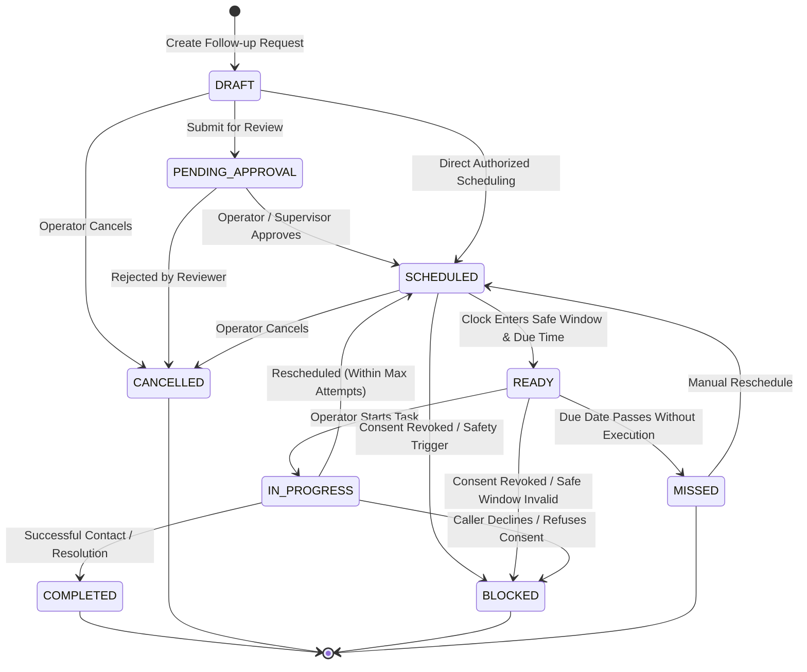

# SAMVED Phase 12 Architecture Specification
**Follow-up Workflow & Continuity Engine — Human-Supervised, Consent-Aware, Auditable, Safe**

## 1. System Mission & Scope
SAMVED is an AI-assisted multilingual victim triage and support-prioritization platform for NHAA 14566.
Phase 12 delivers the **Follow-up Workflow & Continuity Engine**, empowering authorized tele-counselors to create, manage, schedule, track, execute, reschedule, complete, cancel, block, and audit follow-up actions associated with an explicitly identified case.

### Non-Negotiable Boundaries:
1. **Human-Supervised Continuity**: All consequential follow-up actions require explicit, auditable authorization by an operator or approved workflow. Zero autonomous outbound dialer, robot-calling, or unsupervised victim contact is permitted.
2. **Explicit Consent Supremacy**:
   - Consent states: `UNKNOWN`, `REQUESTED`, `GRANTED`, `LIMITED`, `REFUSED`, `REVOKED`, `NOT_APPLICABLE`.
   - Silence is **never** inferred as consent.
   - Material changes in purpose or channel require renewed consent.
   - Caller refusal or revocation immediately halts active contact workflows, transitioning tasks to `BLOCKED`.
3. **Safe Contact Windows**:
   - The engine enforces caller-designated safe contact windows (e.g., `09:00-12:00`, `18:00-20:00`).
   - If no safe window is known, state is marked `CONTACT_WINDOW_UNKNOWN` and human review is required.
4. **Deterministic Safety Precedence**:
   - Phase 4 Deterministic Safety Engine retains unconditional supremacy. Critical ongoing violence or self-harm cannot be deferred to future follow-up callbacks.
   - Phase 5 SVI provides context for urgency and review; SVI never directly triggers automatic contact.
5. **Anti-Harassment & Bounded Recurrence**:
   - Strict maximum attempt caps prevent repetitive contact after non-response.
   - Recurrence rules are bounded (`ONCE`, `DAILY`, `WEEKLY`, `CUSTOM_BOUNDED`) with mandatory max occurrences or end dates. Infinite recurring loops are structurally rejected.
6. **Case Graph & Knowledge Grounding**:
   - Every follow-up record links to an explicit `case_id` via a `HAS_FOLLOW_UP` relationship edge.
   - Follow-ups reference underlying evidentiary turns or statutory policy citations (`citation_ref`).

---

## 2. Follow-up Lifecycle State Machine



### Transition Invariants:
- `DRAFT` $\to$ `SCHEDULED`: Permitted only if `consent_state == GRANTED` and a valid `safe_contact_window` is configured.
- `SCHEDULED` $\to$ `READY`: Transitioned deterministically by the scheduler when `current_time >= scheduled_for` and within caller's safe contact window.
- `IN_PROGRESS` $\to$ `COMPLETED`: Requires an explicit `ContactResult` (`CONTACTED_SUCCESSFULLY`, `REFERRED`, etc.) and completing operator identity.
- Any state $\to$ `BLOCKED`: Immediately enforced upon `CONSENT_REVOKED` or `CALLER_DECLINED`.

---

## 3. Consent Model & Invariants

| Consent State | Meaning | Allowed Follow-up Actions |
| :--- | :--- | :--- |
| **`UNKNOWN`** | Caller has not been asked or no record exists. | Internal review tasks only; external contact blocked. |
| **`REQUESTED`** | Consent inquiry sent/asked; awaiting caller decision. | Draft tasks allowed; scheduling external contact blocked. |
| **`GRANTED`** | Caller explicitly granted permission for stated purpose & channel. | Scheduling and execution permitted within safe contact window. |
| **`LIMITED`** | Granted with specific constraints (e.g., text only, specific hours). | Permitted strictly within specified constraints. |
| **`REFUSED`** | Caller explicitly said no to follow-up. | All outreach workflows blocked. No automated retry. |
| **`REVOKED`** | Caller previously agreed but has now withdrawn permission. | All active tasks immediately set to `BLOCKED`. Audit logged. |
| **`NOT_APPLICABLE`** | Internal operator review task (no caller contact involved). | Internal execution permitted without caller consent. |

---

## 4. Contact Preferences & Safe Windows

### 4.1 Contact Preferences Schema
```json
{
  "preferred_channel": "OPERATOR_CALLBACK",
  "preferred_time_window": "18:00-20:00",
  "days_allowed": ["MON", "TUE", "WED", "THU", "FRI"],
  "safe_to_contact": true,
  "preferred_language": "ta-IN",
  "human_only": true,
  "no_voicemail": true,
  "no_text": false,
  "timezone": "Asia/Kolkata"
}
```

### 4.2 Safe Contact Window Matching
The scheduler validates that any proposed `scheduled_for` timestamp (converted to local timezone) falls strictly between `window_start` and `window_end`. If the caller indicates domestic duress or shared phone risk:
- `no_voicemail = true`: Tele-counselor must not leave voice recordings.
- `human_only = true`: Automated IVR or speech synthesis outreach is prohibited.

---

## 5. Domain Model & Entities

### 5.1 FollowupRecord
```python
class FollowupRecord(BaseModel):
    followup_id: str
    case_id: str
    call_id: Optional[str]
    created_by: str
    assigned_to: Optional[str]
    type: FollowupType
    status: FollowupStatus
    priority: FollowupPriority
    requested_at: str
    scheduled_for: str
    due_at: str
    completed_at: Optional[str]
    cancelled_at: Optional[str]
    consent_state: ConsentState
    contact_preferences: ContactPreferences
    safe_contact_window: Optional[str]
    channel: ContactChannel
    purpose: str
    notes_ref: Optional[str]
    citation_ref: Optional[str]
    source_event: Optional[str]
    last_attempt_at: Optional[str]
    attempt_count: int = 0
    max_attempts: int = 2
    outcome: Optional[FollowupOutcome]
    policy_version: str = "v1.0"
    created_at: str
    updated_at: str
```

---

## 6. Integration Boundaries

1. **Deterministic Safety Engine (Phase 4)**:
   - Evaluates caller risk in realtime. If `safety_state == CRITICAL`, follow-up creation is flagged with high urgency or blocked from replacing immediate emergency handoff.
2. **Stress Vulnerability Index (Phase 5)**:
   - High SVI scores ($>0.70$) elevate follow-up priority to `HIGH` or `CRITICAL_REVIEW`, prompting supervisor oversight before closure.
3. **Multi-Agent Orchestration (Phase 9)**:
   - `FollowupRecommendationAgent` worker recommends bounded follow-up tasks without autonomous execution.
4. **Legal / Policy RAG (Phase 10)**:
   - Links statutory scheme citations (`citation_ref`) so counselors know which verified scheme is being followed up on.
5. **Case Intelligence & Knowledge Graph (Phase 11)**:
   - Attaches `(CASE)-[:HAS_FOLLOW_UP]->(FOLLOW_UP)` edge to the case graph.
   - Attaches `(FOLLOW_UP)-[:BASED_ON]->(EVIDENCE/CITATION)` for provenance.
