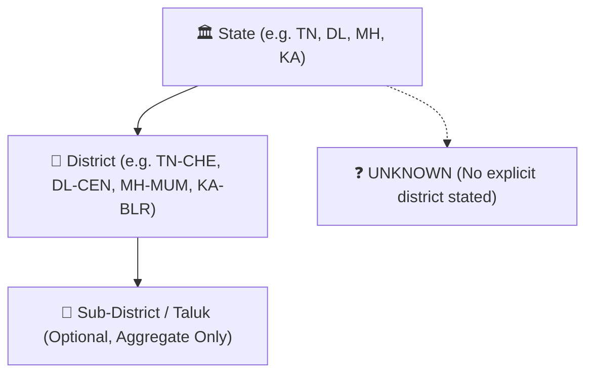
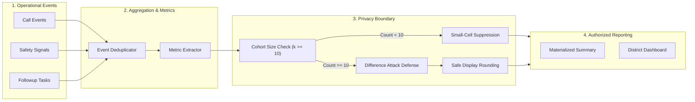

# Phase 13 System Architecture: District Intelligence & Operational Analytics
**Privacy-Preserving, Explainable, Non-Predictive, Human-Supervised**

## 1. Executive Summary & Problem Statement

Phase 13 establishes the aggregated operational intelligence and district-level reporting foundation for the SAMVED National Drug De-Addiction Helpline (NHAA 14566) under the Ministry of Social Justice and Empowerment (MoSJE), Government of India.

Helpline administrators, supervisors, and capacity planners need visibility into macro operational trends:
- Call volumes and surge patterns across districts and reporting periods.
- Multilingual distribution and language-specific support demand.
- Distribution of deterministic safety states and SVI vulnerability bands.
- Counselor workload, handoff queues, and operational response times.
- Care continuity follow-up completion rates, missed contacts, and consent status.
- Statutory knowledge retrieval demand and service category pressure.

Crucially, **Phase 13 is strictly operational analytics, NOT surveillance or prediction.** It is engineered with non-negotiable boundaries:
$$\text{Operational Events} \longrightarrow \text{Privacy / Aggregation Boundary} \longrightarrow \text{Validated Metrics} \longrightarrow \text{Time / District / Service Dimensions} \longrightarrow \text{Materialized Summaries} \longrightarrow \text{Authorized Human Planner}$$

---

## 2. Core Operational Principles & Non-Goals

### 2.1 Explicit Goals
1. **Aggregated Operational Intelligence**: Provide macro capacity metrics, language trends, and service category demand to guide helpline staffing, training, and resource allocation.
2. **K-Anonymity & Small-Cell Suppression**: Enforce strict suppression ($k \ge 10$) on small cohorts and prevent complementary difference/subtraction attacks.
3. **Trust Classification Model**: Every metric is explicitly classified as `OBSERVED`, `CALCULATED`, `ESTIMATED`, `SUPPRESSED`, or `UNAVAILABLE`.
4. **Deterministic Trend Analysis**: Period-over-period trend calculations (`RISING`, `FALLING`, `STABLE`, `INSUFFICIENT_DATA`), never speculative AI predictions.
5. **Bounded Geographic Granularity**: District-level maximum resolution (`TN-CHE`, `DL-CEN`, `MH-MUM`, `KA-BLR`, `UNKNOWN`). Zero GPS or household coordinates.
6. **Role-Based Access Governance**: Tiered access (`OPERATOR`, `SUPERVISOR`, `DISTRICT_ADMIN`, `SYSTEM_ADMIN`) with immutable access audit logs.

### 2.2 Strict Non-Goals & Architectural Prohibitions
To prevent predictive policing, algorithmic bias, or victim surveillance, SAMVED Phase 13 enforces the following absolute prohibitions:
- ❌ **NO Individual Victim Ranking**: No scoring, ranking, or classifying individual callers as high-risk or problematic.
- ❌ **NO Offender / Criminal Propensity Scoring**: No predicting whether a person is an offender, dangerous, or likely to commit future offenses.
- ❌ **NO Neighborhood / District Danger Scores**: Never generate composite "danger ratings" or "crime propensity scores" for districts or regions.
- ❌ **NO Predictive Crime / Violence Forecasting**: Never predict future incidents, violence probability, or hotspot crime forecasts.
- ❌ **NO Biometric or Demographic Profiling**: Never infer religion, caste, ethnicity, or political affiliation from language, dialect, or voice acoustics.
- ❌ **NO Autonomous Dispatch or Enforcement Triggers**: Analytics dashboards never trigger police raids, emergency dispatches, or denial of public services.
- ❌ **NO Individual Drill-Down**: District dashboards strictly provide aggregate views. Clicking an aggregate chart never lists individual callers or PII.

---

## 3. Analytics Trust Model

Every reported metric carries an explicit trust classification so decision-makers understand how the value was produced:

| Classification | Meaning | Examples |
| :--- | :--- | :--- |
| **`OBSERVED`** | Directly counted from recorded operational events without estimation. | `calls_received`, `unique_case_count`, `followups_created` |
| **`CALCULATED`** | Mathematically derived from observed counts using deterministic formulas. | `average_response_time`, `completion_rate`, `safety_distribution_pct` |
| **`ESTIMATED`** | Statistically estimated or smoothed based on historical aggregates. | `service_capacity_indicator`, `smoothed_volume_trend` |
| **`SUPPRESSED`** | Hidden to protect caller privacy because cohort size $< k$ ($k=10$). | Low-volume district-language-safety intersections |
| **`UNAVAILABLE`** | Data could not be computed due to missing records or system degradation. | Metric during an external sensor outage |

---

## 4. Geographic Hierarchy & Normalization

### 4.1 Granularity Model

### 4.2 Location Boundaries
1. **Source of Truth**: District is extracted ONLY from explicit caller-stated metadata or operator-verified case Intake records.
2. **Deterministic Normalization**: Dialect/alias variants are normalized using a deterministic mapping table:
   - "Chennai", "Madras" $\longrightarrow$ `TN-CHE` (Chennai, Tamil Nadu)
   - "Central Delhi", "New Delhi" $\longrightarrow$ `DL-CEN` (Central Delhi, Delhi)
   - "Mumbai", "Bombay", "Mumbai City" $\longrightarrow$ `MH-MUM` (Mumbai, Maharashtra)
   - "Bengaluru", "Bangalore", "Bengaluru Urban" $\longrightarrow$ `KA-BLR` (Bengaluru Urban, Karnataka)
   - Ambiguous or unstated location $\longrightarrow$ `UNKNOWN`
3. **Zero Inferred Precision**: The system NEVER infers exact caller coordinates, GPS traces, cell tower triangulations, or household street addresses.

---

## 5. Time Dimensions & Reporting Timezone

### 5.1 Time Resolution
- **`HOUR`**: Operational intra-day staffing and queue monitoring (T-1 hour delay for sensitive metrics).
- **`DAY`**: Daily operational review, volume tracking, and supervisor balancing.
- **`WEEK`**: Weekly operational trends, language demand shifts, and capacity planning.
- **`MONTH`**: Monthly statutory reporting, program evaluation, and IRCA referral capacity.
- **`QUARTER`**: Quarterly policy reviews and MoSJE administrative reporting.

### 5.2 Timezone Invariant
All event timestamps are ingested and persisted in **UTC** (`TIMESTAMPTZ`). Display aggregation and reporting buckets are computed in the standard national reporting timezone: **`Asia/Kolkata`** (IST, UTC+05:30).

---

## 6. Privacy Safeguards & Suppression Engine

### 6.1 K-Anonymity & Minimum Cohort Size ($k=10$)
Any metric cell representing fewer than $k=10$ individual records (calls, cases, or people) is automatically suppressed. The cell returns:
- `display_value = "SUPPRESSED"`
- `metric_status = "SUPPRESSED"`
- `raw_count = null` (never exposed to UI or client JSON)
- `suppressed = true`

### 6.2 Complementary Suppression (Difference Attack Defense)
If a district total is 12, and Category A is 10, then Category B (2) would naturally be suppressed. However, if Total (12) and Category A (10) are shown, an adversary can calculate $12 - 10 = 2$.
To prevent this difference attack:
- If a breakdown has exactly one suppressed cell, the second-smallest cell is also suppressed (complementary suppression), OR the category total is suppressed.

### 6.3 Display Rounding
For macro volume charts, counts exceeding 1,000 may be formatted with safe rounding (e.g. `~1.2K`) while preserving internal metric consistency.

### 6.4 Delayed Reporting
Real-time micro-bursts of calls in low-volume districts can de-anonymize callers. Sensitive safety and SVI distributions enforce a standard reporting delay window (e.g. T-1 day or closed-period batches) to prevent correlating live calls with dashboard updates.

---

## 7. Versioned Metric Catalog (`v1.0.0`)

| Metric ID | Category | Trust Status | Formula / Definition | Privacy Rule |
| :--- | :--- | :--- | :--- | :--- |
| `calls_received` | Volume | `OBSERVED` | $\sum \text{CALL\_STARTED events in period}$ | Suppressed if $< 10$ |
| `calls_completed` | Volume | `OBSERVED` | $\sum \text{CALL\_ENDED events in period}$ | Suppressed if $< 10$ |
| `calls_abandoned` | Volume | `OBSERVED` | $\sum \text{Calls disconnected before triage}$ | Suppressed if $< 10$ |
| `unique_case_count` | Volume | `OBSERVED` | $\text{Count of unique case\_id in period}$ | Suppressed if $< 10$ |
| `safety_state_distribution` | Safety | `CALCULATED` | % distribution across `NONE`, `WATCH`, `ELEVATED`, `HIGH`, `CRITICAL` | Any band $< 10$ suppressed |
| `svi_band_distribution` | SVI | `CALCULATED` | % distribution across `LOW`, `MODERATE`, `HIGH`, `CRITICAL` | Any band $< 10$ suppressed |
| `average_svi` | SVI | `CALCULATED` | $\frac{\sum \text{svi\_score}}{N}$ for cases with SVI | Suppressed if $N < 10$ |
| `calls_by_language` | Language | `OBSERVED` | Breakdown by primary language (`hi-IN`, `ta-IN`, `te-IN`, `en-IN`, etc.) | Any lang $< 10$ suppressed |
| `service_demand_distribution` | Services | `CALCULATED` | Breakdown by standardized category (`SAFETY_SUPPORT`, `COUNSELING`, `LEGAL`, etc.) | Any cat $< 10$ suppressed |
| `human_takeover_count` | Operator | `OBSERVED` | $\sum \text{OPERATOR\_TAKEOVER events}$ | Suppressed if $< 10$ |
| `operator_response_time_sec` | Operator | `CALCULATED` | Median elapsed seconds between call connect and operator review/takeover | Suppressed if $N < 10$ |
| `followup_completion_rate` | Follow-up | `CALCULATED` | $\frac{\text{COMPLETED}}{\text{COMPLETED} + \text{MISSED} + \text{CANCELLED}} \times 100\%$ | Suppressed if total $< 10$ |
| `followup_missed_rate` | Follow-up | `CALCULATED` | $\frac{\text{MISSED}}{\text{COMPLETED} + \text{MISSED} + \text{CANCELLED}} \times 100\%$ | Suppressed if total $< 10$ |
| `knowledge_query_count` | Knowledge | `OBSERVED` | $\sum \text{KNOWLEDGE\_SEARCH events}$ | Public / aggregate |
| `system_stt_failure_rate` | System | `CALCULATED` | $\frac{\text{STT\_ERROR}}{\text{TOTAL\_AUDIO\_TURNS}} \times 100\%$ | System operational |
| `system_api_latency_p95` | System | `CALCULATED` | 95th percentile REST & WS turnaround time (ms) | System operational |

---

## 8. Role-Based Access Governance

| Role | Scope of Access | Authorized Operations |
| :--- | :--- | :--- |
| **`OPERATOR`** | Assigned live calls only | Live call handling, notes, follow-up execution. **No macro district analytics.** |
| **`SUPERVISOR`** | Operational team & shifts | Counselor workload, queue response times, real-time handoff metrics. |
| **`DISTRICT_ADMIN`** | Assigned district(s) | Aggregated district summaries, language demand, service category demand, follow-up completion rates. |
| **`SYSTEM_ADMIN`** | National / cross-district | Cross-district summaries, system reliability, aggregation job triggers, audit review. |

Every access to `/v1/analytics/*` is verified against the actor's role and logged in `analytics_access_audit` with timestamp, actor ID, district requested, and privacy annotations.

---

## 9. Materialized Summaries & Batch Aggregation

To guarantee sub-50ms dashboard response times without scanning millions of raw call and utterance rows:
1. **Periodic Aggregation Job (`analytics_job_runs`)**:
   Runs deterministically to extract raw events, compute metrics, evaluate privacy thresholds, and persist pre-aggregated rows into `analytics_district_summaries` and `analytics_metric_values`.
2. **Late-Event Bounded Recomputation**:
   If an operator adds notes or an offline follow-up attempt arrives late, the aggregation job recomputes only the affected closed daily bucket, preventing double-counting via unique event deduplication (`event_id`).
3. **Data Quality Tracking**:
   Every summary tracks `source_event_count`, `processed_count`, `excluded_count`, and `suppressed_count`. If data quality degrades, a prominent `DATA QUALITY DEGRADED` banner is served on the dashboard.

---

## 10. Dashboard & User Interface Architecture

The `/analytics` dashboard provides a clean, highly accessible, non-punitive visualization layer:
- **Governance Watermark**: Prominently displayed disclaimer:
  > *"Aggregated operational analytics for capacity planning and quality assurance. Not a predictive risk score. Not for individual enforcement decisions."*
- **Filter Bar**: State, District, Reporting Period (7d, 30d, 90d, custom), Language, and Service Category.
- **KPI Overview Strip**: Total Calls (with trend badge: `RISING`, `FALLING`, `STABLE`), Completed Calls, Unique Cases, Active Follow-ups, Avg Response Time, Safety Escalations.
- **Seven Core Visual Sections**:
  1. *Call Volume & Trends* (Accessible bar/line visualization + tabular data).
  2. *Safety State & SVI Severity Distributions* (Percentage breakdown).
  3. *Multilingual Demand & Language Mix* (Hindi, Tamil, English, etc.).
  4. *Standardized Service Category Demand* (Counseling, Shelter, Legal, Medical, Follow-up).
  5. *Follow-up & Care Continuity Workload* (Completed, Missed, Blocked, Completion Rate).
  6. *Operator Workload & Response Times* (Handoffs, Active load, Takeover latency).
  7. *Knowledge Grounding & System Health* (Query rates, STT/TTS health, WebSocket reconnects).
- **Suppression State Component**: Replaces chart segments or metric cards with clear `SUPPRESSED` indicators and informative hover tooltips.
- **Metric Detail Drawer**: Clicking any metric opens an inspector showing the exact mathematical definition, calculation method, trust category, privacy status, and version.
- **Compact Operator Link**: A streamlined button `Operations Analytics` in the `/calls` workstation header allows authorized counselors and supervisors to seamlessly navigate to the analytics dashboard.
