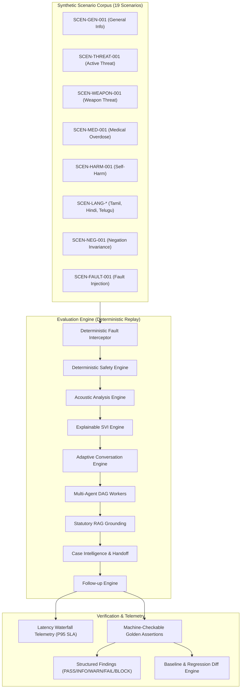

# SAMVED Phase 14 Architecture: Scenario Simulator & Evaluation Lab

## 1. Executive Summary & Mission
The **Scenario Simulator & Evaluation Lab** provides a deterministic, repeatable, and non-intrusive evaluation laboratory to replay multi-turn synthetic caller scenarios across all SAMVED subsystems without engaging live telephony carrier trunks, exposing real victim records, or invoking live emergency dispatch services.

The lab verifies:
- **Deterministic Safety Authority**: Unconditional precedence of deterministic safety rules (`DeterministicSafetyEngine`).
- **Explainable SVI Calibration**: Prototype score (0–100) and band validation with critical override floors.
- **Acoustic Paralinguistic Signals**: Physical voice activity, pause duration, clipping, and energy variability without psychological or emotional classification.
- **Adaptive Conversational Strategies**: Dynamic dialogue planning across priority levels `P0` through `P5`.
- **Multi-Agent Orchestration Resilience**: Graceful degradation under worker timeouts (`ORCHESTRATION_TIMEOUT`) and stale result rejection.
- **Statutory RAG Grounding**: Statutory citations (NDPS Act Section 64A, PWDVA 2005, One Stop Centre Scheme).
- **Follow-up & Case Intelligence**: Supervised handoff and follow-up scheduling with `autonomous_dispatch = false`.
- **District Analytics Isolation**: Strict synthetic data isolation (`SYNTHETIC_EVALUATION`).

---

## 2. Inviolable Governance & Safety Invariants
1. **Safety Precedence Inviolable**: The simulator CANNOT override or lower the authoritative determination of `DeterministicSafetyEngine`.
2. **Mandatory Human Supervision**: Any scenario classified as `HIGH` or `CRITICAL` safety mandates `human_review_required = true`.
3. **Zero Autonomous Outbound Action**: Autonomous police dispatch (`autonomous_police_dispatch`), emergency services calling, or automated outbound telephony are strictly forbidden.
4. **Synthetic Data Hygiene**: All evaluation scenarios, caller identities, and transcriptions are synthetic (`SIM-CALL-*`, `SIM-CASE-*`, `SYNTHETIC-CALLER-*`).

---

## 3. Subsystem Architecture & Replay Pipeline

---

## 4. Benchmark Scenario Corpus (Categories A through Q)
| Category | Scenario ID | Description | Locale | Expected Safety | Expected SVI |
|---|---|---|---|---|---|
| A. General Support | `SCEN-GEN-001` | IRCA facility operating hours inquiry | `en-IN` | `SAFE` | `LOW` (0-25) |
| B. Active Threat | `SCEN-THREAT-001` | Armed supplier attempting forced entry | `hi-IN` | `CRITICAL` | `CRITICAL` (76-100) |
| C. Weapon Context | `SCEN-WEAPON-001` | Brandishing kitchen knife in domestic dispute | `en-IN` | `CRITICAL` | `CRITICAL` (76-100) |
| D. Medical Emergency | `SCEN-MED-001` | Acute opioid overdose & respiratory arrest | `en-IN` | `CRITICAL` | `CRITICAL` (76-100) |
| E. Self-Harm | `SCEN-HARM-001` | Acute suicidal ideation & poison consumption | `hi-IN` | `CRITICAL` | `CRITICAL` (76-100) |
| F. Confinement | `SCEN-CONFINE-001` | Involuntary locking in unauthorized facility | `en-IN` | `HIGH` | `HIGH` (51-75) |
| G. Stalking / Coercion | `SCEN-COERCE-001` | Physical pursuit & substance extortion | `hi-IN` | `HIGH` | `HIGH` (51-75) |
| H. Isolation | `SCEN-ISOL-001` | Elderly isolation & unprescribed sedative use | `en-IN` | `SAFE` | `MODERATE` (26-50) |
| I. Multilingual (Tamil) | `SCEN-LANG-TA-001` | Tanglish withdrawal & acute chest pain | `ta-IN` | `CRITICAL` | `CRITICAL` (76-100) |
| I. Multilingual (Hindi) | `SCEN-LANG-HI-001` | Hinglish craving & relapse anxiety | `hi-IN` | `SAFE` | `MODERATE` (26-50) |
| I. Multilingual (Telugu) | `SCEN-LANG-TE-001` | Tenglish de-addiction consultation | `te-IN` | `SAFE` | `LOW` (0-25) |
| J. Negation Context | `SCEN-NEG-001` | Explicit denial of weapons presence | `en-IN` | `SAFE` | `LOW` (0-25) |
| K. Interruption / Barge-in | `SCEN-BARGE-001` | Abrupt caller barge-in reporting chest pain | `hi-IN` | `CRITICAL` | `CRITICAL` (76-100) |
| L. Follow-up Continuity | `SCEN-FOL-001` | Scheduled post-discharge safety check-in | `en-IN` | `SAFE` | `LOW` (0-25) |
| M. Operator Handoff | `SCEN-HANDOFF-001` | Multi-dimension handoff evidence package | `en-IN` | `CRITICAL` | `CRITICAL` (76-100) |
| N. Statutory RAG | `SCEN-RAG-001` | NDPS Section 64A immunity inquiry | `en-IN` | `SAFE` | `LOW` (0-25) |
| O. Fault Injection | `SCEN-FAULT-001` | Orchestration agent timeout resilience | `en-IN` | `CRITICAL` | `CRITICAL` (76-100) |
| P. Acoustic Signals | `SCEN-ACOUSTIC-001` | Rapid speech ratio & high energy variability | `en-IN` | `SAFE` | `MODERATE` (26-50) |
| Q. Analytics Isolation | `SCEN-ANALYTICS-001` | Synthetic marker isolation verification | `en-IN` | `SAFE` | `LOW` (0-25) |

---

## 5. Regression Diff & Baseline Governance
Evaluation runs can be promoted to golden baselines (`BaselineSnapshot`). Subsequent runs are diffed against these baselines:
- **Regression Criteria**:
  - Safety severity drop (e.g. `CRITICAL` or `HIGH` downgraded to `SAFE`).
  - Human review requirement dropped on a hazardous scenario.
  - P95 latency growth > 50% and > 50ms over baseline.
  - Overall status regression from `PASS` to `FAIL` or `BLOCKED`.
- **Drift Criteria**:
  - SVI score change across band thresholds without safety regression.
  - Conversational strategy adjustments.
