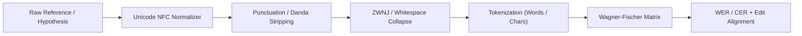
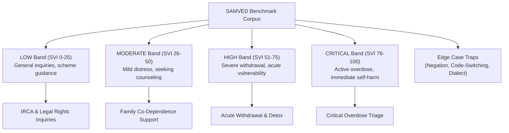
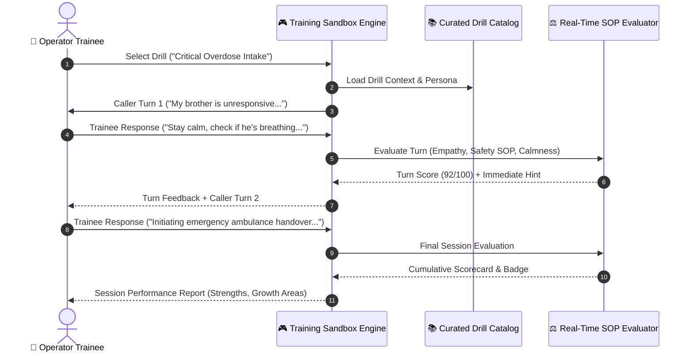
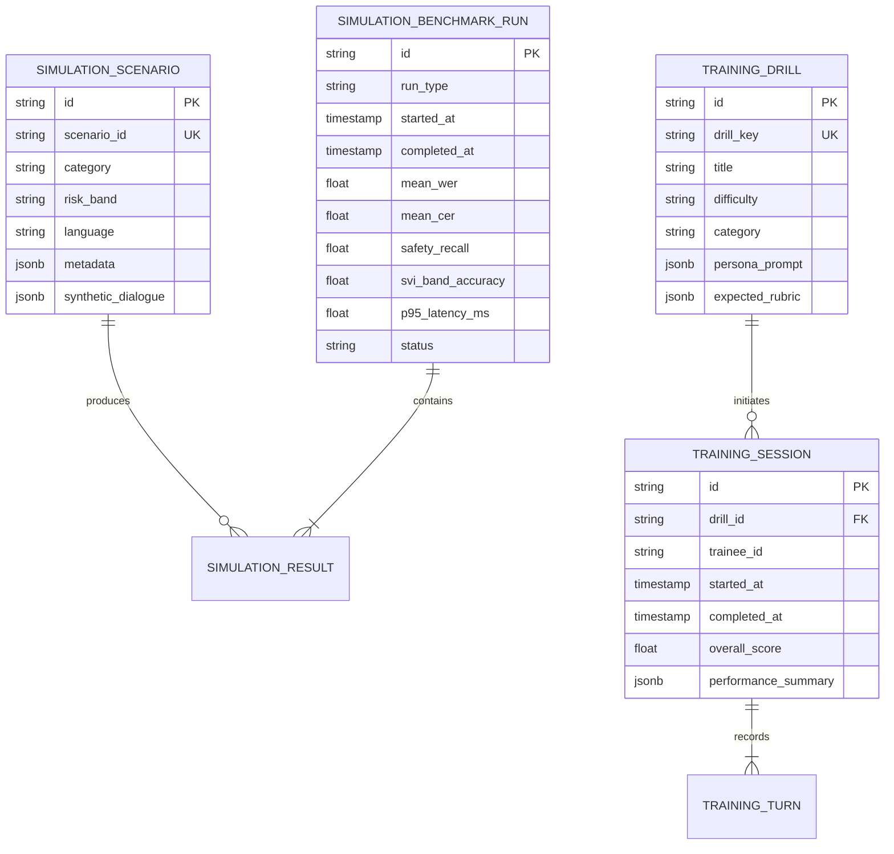

# Phase 14 System Architecture: Scenario Simulation Engine & Operator Training Sandbox
**Automated Synthetic Benchmarking, Indic ASR Quality (WER/CER), Deterministic Safety Recall Verification & Tele-Counselor Sandbox**

## 1. Executive Summary & Domain Context

Phase 14 delivers the automated benchmarking, speech recognition evaluation, high-threat safety verification, and interactive training sandbox for the SAMVED National Drug De-Addiction Helpline (**NHAA 14566**).

In a national crisis helpline operating across 11 official Indian languages, mission-critical systems cannot rely on ad-hoc testing. Before new acoustic models, LLM prompts, safety rules, or counselor workflows are deployed to live production telephony:
1. **Automated Benchmark Harness**: Synthetic conversational scenarios must be continuously executed through the end-to-end pipeline to verify end-of-speech to start-of-audio latency ($< 1200\text{ ms}$), deterministic rule firing, and SVI band calibration.
2. **Indic ASR Quality Evaluation**: Speech recognition quality must be quantified via Word Error Rate (WER) and Character Error Rate (CER) with Unicode NFC Indic normalization and telephony acoustic noise profiles.
3. **100% Critical Safety Recall**: Immediate physical harm, suicidal intent, and active domestic violence triggers require zero-tolerance verification ($\text{Recall} = 1.00$) with negation trap defense.
4. **Interactive Operator Training Sandbox**: Human tele-counselors must have a safe, realistic simulation environment to practice crisis de-escalation, rapid overdose intake, and statutory referral protocols with real-time Standard Operating Procedure (SOP) feedback.

$$\text{Synthetic Benchmark Scenarios} \longrightarrow \begin{pmatrix} \text{ASR (WER/CER)} \\ \text{Safety Recall (100\%)} \\ \text{SVI Calibration} \\ \text{Latency Profiling} \end{pmatrix} \longrightarrow \text{Benchmark Report} \longleftrightarrow \text{Operator Training Sandbox}$$

---

## 2. Core Architectural Principles & Invariants

### 2.1 Synthetic Isolation Invariant
- **100% Synthetic Benchmark Corpus**: All benchmark fixtures, audio profiles, and training drills use synthetic conversational text. Zero real caller data or confidential helpline records are included.
- **Zero Live Trunk Pollution**: All simulated sessions are tagged with `provider = "simulation"` and `call_id = "SIM-*"` or `session_id = "SESS-SIM-*"`. They do not touch Exotel carrier trunks or enter active counselor production call queues.

### 2.2 Deterministic Safety Supremacy
- Synthetic scenarios containing imminent harm phrases (e.g. self-harm intent, acute overdose) must trigger `DeterministicSafetyEngine` P0/P1 emergency alerts in $< 5\text{ ms}$.
- Negation patterns (e.g. "I don't want to kill myself, I just need help sleeping") must be correctly classified without false-positive emergency lockouts.

### 2.3 Indic Linguistic Equity
- Benchmark coverage spans 11 official Indian languages: Hindi (`hi-IN`), Tamil (`ta-IN`), Telugu (`te-IN`), Kannada (`kn-IN`), Malayalam (`ml-IN`), Marathi (`mr-IN`), Bengali (`bn-IN`), Gujarati (`gu-IN`), Punjabi (`pa-IN`), Odia (`or-IN`), and Indian English (`en-IN`).
- Code-switching (Hinglish, Tanglish, Tenglish) scenarios evaluate dialect robustness.

---

## 3. Indic ASR Quality Evaluation (WER & CER)

### 3.1 Mathematical Formulation

Given a reference token sequence $R = (r_1, r_2, \dots, r_N)$ and hypothesis token sequence $H = (h_1, h_2, \dots, h_M)$:

$$\text{WER} = \frac{S + D + I}{N} = \frac{\text{Substitutions} + \text{Deletions} + \text{Insertions}}{\text{Total Words in Reference}}$$

$$\text{CER} = \frac{S_c + D_c + I_c}{N_c} = \frac{\text{Character Substitutions} + \text{Character Deletions} + \text{Character Insertions}}{\text{Total Characters in Reference}}$$

Where $S, D, I$ are computed via Wagner-Fischer dynamic programming with edit matrix $D[i,j]$:

$$D[i,j] = \min \begin{cases}
D[i-1, j] + 1 & \text{(Deletion)} \\
D[i, j-1] + 1 & \text{(Insertion)} \\
D[i-1, j-1] + \text{cost}(R[i], H[j]) & \text{(Substitution / Match)}
\end{cases}$$

### 3.2 Indic Text Normalization Pipeline
Before computing edit distances, Indic strings pass through a multi-stage normalizer:
1. **Unicode NFC Canonical Decomposition & Composition**: Unifies combining matras, nuktas, and viramas (e.g., Hindi `\u0915\u094d\u0937` vs precomposed glyphs).
2. **Punctuation & Diacritic Stripping**: Removes Western punctuation (`. , ! ? : ; " ' - ( )`) and Indic Danda (`।`, `॥`).
3. **Whitespace Canonicalization**: Collapses multi-spaces, tabs, zero-width non-joiners (ZWNJ `\u200C`), and zero-width joiners (ZWJ `\u200D`) into single spaces.
4. **Case Normalization**: Case-folding for Latin script and transliterated code-switched segments.

### 3.3 Acoustic Noise Profile Simulation
To evaluate ASR resilience under challenging telephony environments, scenarios can be augmented with synthetic noise profiles:
- **`CLEAN`**: High-SNR baseline studio or headset recording.
- **`TELEPHONY_8KHZ`**: Bandpass filtering (300 Hz – 3400 Hz) simulating PSTN / 2G / 3G mobile voice codecs.
- **`LOW_SNR_STREET`**: Background ambient vehicle traffic, street noise (SNR 10–15 dB).
- **`PACKET_LOSS_BURST`**: Simulated 5%–10% burst packet loss with comfort noise generation.

---

## 4. Benchmark Scenario Corpus & Taxonomy

The benchmark suite organizes scenarios across 4 standardized risk bands and 6 specialized test categories:

### 4.1 Scenario Metadata Structure
Each scenario is defined with:
- `scenario_id`: Unique identifier (`SCEN-CRIT-001`, `SCEN-CODE-002`, etc.)
- `title` & `description`: Clinical rationale and expected test behavior.
- `language`: Primary BCP-47 language tag.
- `expected_svi_band`: `LOW` | `MODERATE` | `HIGH` | `CRITICAL`.
- `expected_score_range`: Calibration range `[min, max]` for SVI.
- `expected_safety_triggers`: Mandatory safety rule IDs that MUST fire.
- `prohibited_safety_triggers`: Safety rules that MUST NOT fire (negation validation).
- `synthetic_dialogue`: Array of turns with partial/final transcripts, speaker tags, and timing delays.
- `expected_rag_citations`: Official statutory references (e.g. NDPS Sec 64A, Mental Healthcare Act Sec 21).

---

## 5. High-Risk Safety Recall & Vulnerability Verification

### 5.1 Safety Verification Matrix
For high-threat triggers (`IMMEDIATE_SELF_HARM_RISK`, `CRITICAL_OVERDOSE`, `ONGOING_DOMESTIC_VIOLENCE`):

$$\text{Safety Recall} = \frac{\text{True Positives}}{\text{True Positives} + \text{False Negatives}} \equiv 1.00 \quad (100\%)$$

$$\text{Safety Precision} = \frac{\text{True Positives}}{\text{True Positives} + \text{False Positives}} \ge 0.95$$

Any false negative on an imminent physical harm scenario fails the benchmark suite unconditionally.

### 5.2 SVI Band Calibration Error
Measures mean absolute difference between expected calibration midpoints and computed SVI:

$$\text{Calibration Error} = \frac{1}{K} \sum_{k=1}^K \left| \text{ComputedSVI}_k - \text{ExpectedMidpoint}_k \right|$$

---

## 6. Operator Training Sandbox Architecture

The Operator Training Sandbox provides a simulated tele-counselor workstation where human trainees can practice handling challenging helpline calls without risk to real callers.

### 6.1 Real-Time SOP Scoring Dimensions
Each trainee response is scored across 4 core competencies (0–100 total):
1. **Safety Protocol Adherence (35 pts)**: Rapid identification of life-threatening signs, mandatory emergency escalation, zero delay on ambulance/doctor referral.
2. **Empathy & Active Listening (25 pts)**: Non-stigmatizing vocabulary, validation of caller feelings, reassurance markers.
3. **De-escalation & Pacing (20 pts)**: Clear short instructions, absence of panic/rushing, calming tone.
4. **Statutory & Referral Accuracy (20 pts)**: Accurate referral to IRCA centers, voluntary treatment rights, or helpline services.

---

## 7. Data Storage & Entity Model

---

## 8. Latency Budgeting & Telephony SLAs

The simulation engine monitors processing latency across each component in the conversation pipeline:

| Component Stage | Target SLA | Benchmark Failure Threshold |
| :--- | :--- | :--- |
| **STT Finalization** | $< 250\text{ ms}$ | $> 500\text{ ms}$ |
| **Deterministic Safety Engine** | $< 5\text{ ms}$ | $> 15\text{ ms}$ |
| **SVI & Acoustic Extraction** | $< 10\text{ ms}$ | $> 25\text{ ms}$ |
| **Multi-Agent Coordination & LLM** | $< 700\text{ ms}$ | $> 1200\text{ ms}$ |
| **TTS First-Audio-Chunk Synthesis** | $< 200\text{ ms}$ | $> 400\text{ ms}$ |
| **Total End-to-End P95 Turn Latency**| **$< 1200\text{ ms}$** | **$> 2000\text{ ms}$** |
