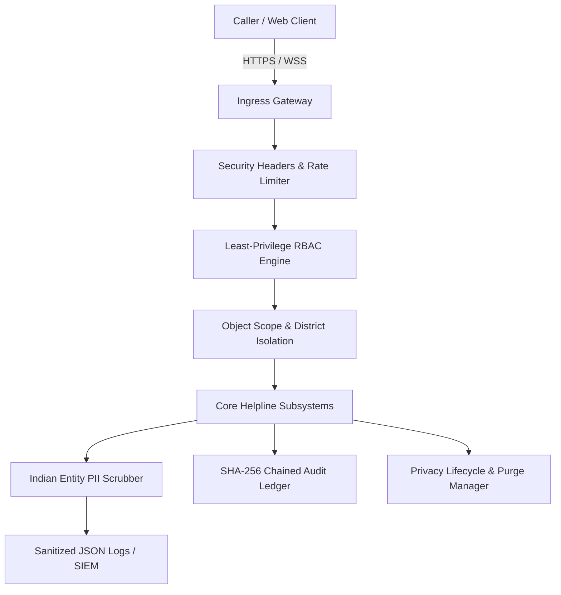

# SAMVED Architecture: Phase 15 Security, Privacy & Governance Hardening

## 1. System Overview
SAMVED Phase 15 hardens the platform's security posture, privacy safeguards, auditability, abuse resistance, and governance controls without altering its core mission. SAMVED is an AI-assisted, human-supervised victim support triage system for high-stakes public service helplines (NHAA 14566).

## 2. Inviolable Governance Principles
1. **Zero Autonomous Dispatch**: The system cannot automatically dispatch law enforcement, emergency medical services, or social workers without explicit human supervisor confirmation.
2. **Zero Automated Legal Adjudication**: SAMVED is not a lie detector, clinical diagnosis engine, or predictive policing tool. SVI scores and safety alerts are decision-support aids for human operators.
3. **Data Minimization & Purpose Limitation**: Indian entity PII (Aadhaar, PAN, phone numbers, emails, bank accounts) is scrubbed from transcripts, logs, and downstream model prompts by default.
4. **Auditability & Provenance**: Every model inference, human override, escalation, and data mutation is recorded in an append-only, SHA-256 chained audit trail.
5. **Defense-in-Depth & Fail-Safe**: Failures in security subsystems (e.g. rate limiters or PII scrubbers) fail closed or sanitize strictly.

## 3. Subsystem Specifications

### 3.1 Role-Based Access Control (RBAC)
Five strictly defined roles:
- **OPERATOR**: Live call handling, case intake, notes drafting, operator training sandbox.
- **SUPERVISOR**: Global case oversight, escalation overrides, cross-district review, retention purge approvals.
- **DISTRICT_ADMIN**: Scoped strictly to assigned district analytics and administrative reporting.
- **AUDITOR**: Read-only access across audit ledgers, compliance logs, and simulation runs.
- **SYSTEM_ADMIN**: Full system maintenance and configuration.

### 3.2 Insecure Direct Object Reference (IDOR) & District Isolation
- District Admins assigned to one district (e.g. Kolkata) receive HTTP 403 Forbidden if attempting to access cases or analytics from another district (e.g. Nadia).
- Operators cannot mutate cases assigned to other operators without supervisor handoff.
- Synthetic simulation executions are strictly quarantined from mutating production case records.

### 3.3 Indian Entity PII Redaction Pipeline
Provides regex and heuristic scrubbing for:
- **Aadhaar**: `\b([2-9]\d{3})[ -]?(\d{4})[ -]?(\d{4})\b` -> `[REDACTED_AADHAAR:XXXX-XXXX-last4]`
- **PAN**: `\b([A-Z]{5}\d{4}[A-Z])\b` -> `[REDACTED_PAN:ABXXXXXF]`
- **Indian Mobile**: `(?:\+91[\-\s]?)?[6-9]\d{9}` -> `[REDACTED_PHONE:+91-XXXXX-last4]`
- **Bank Account**: Preceded by account keywords -> `A/C [REDACTED_ACCOUNT:XXXXlast4]`
- **Email**: Standard RFC regex -> `[REDACTED_EMAIL]`

### 3.4 Cryptographically Chained Audit Ledger
Each audit entry computes a deterministic SHA-256 hash chaining back to the previous entry:
$$H_i = \text{SHA-256}(H_{i-1} \parallel \text{timestamp} \parallel \text{actor\_id} \parallel \text{actor\_role} \parallel \text{action} \parallel \text{resource\_id} \parallel \text{status\_result} \parallel \text{details})$$
Genesis hash $H_0 = 0^{64}$. Any tampering with past records invalidates the hash chain and pinpoints the corrupted record index.

### 3.5 Rate Limiting & WebSocket Abuse Prevention
- In-memory sliding window rate limiter protects endpoints against volumetric bombardment.
- WebSocket frame sizes bounded to $\le 64\text{ KB}$.
- WebSocket message rate limited to 10 messages/second per connection.
