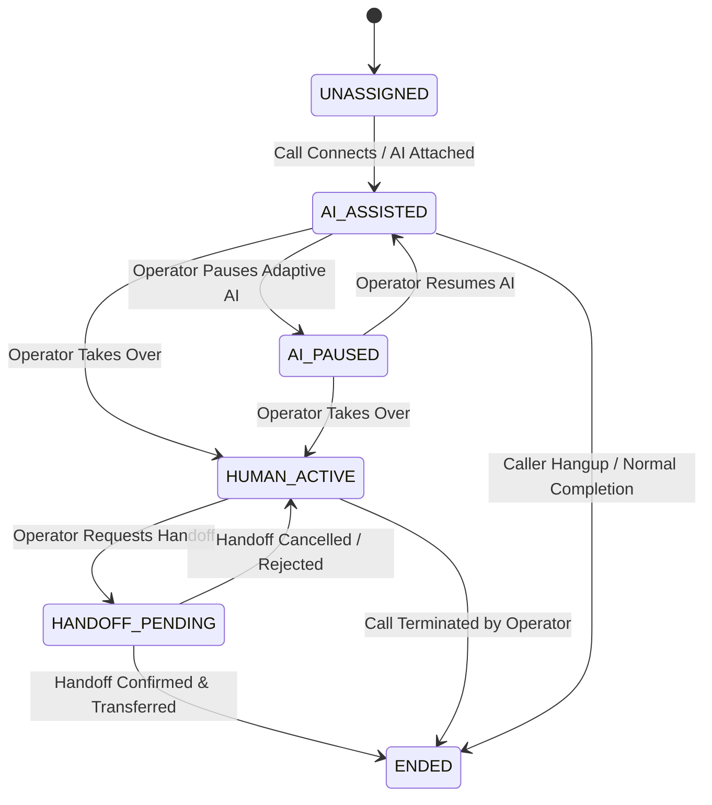

# SAMVED — Phase 8 Architecture: Human Operator Console & Tele-Counselor Workstation

## 1. Executive Summary & Design Philosophy
SAMVED is an AI-assisted multilingual victim triage and support-prioritization platform for NHAA 14566. 

**Core Human-in-the-Loop Principle:**
> **AI assists. Human supervises. Safety rules constrain. Operator overrides. All actions are audited.**

SAMVED is explicitly **NOT**:
- A therapist or psychiatric counselor
- A clinical or medical diagnostic system
- A legal decision engine
- A lie detector or credibility detector
- An autonomous emergency-dispatch system
- A replacement for trained human operators

Phase 8 elevates the existing operator monitoring console into a professional, human-supervision **Tele-Counselor Workstation**. The workstation provides full situational awareness during live calls, empowering operators to intervene, override AI decisions, request safety audits, execute warm handoffs, take structured observations, and maintain an immutable audit trail without losing control or situational context.

---

## 2. Workstation Information Hierarchy & Layout

The workstation provides high situational clarity under high-stress conditions:

```
┌────────────────────────────────────────────────────────────────────────────────────────┐
│ Top Bar: SAMVED Operator Console | Safety Engine v1.0.0 | Mode: DEV/LIVE | WS Status    │
├────────────────────────────────────────────────────────────────────────────────────────┤
│ Live Call Status Header:                                                               │
│ [Call ID] [Masked Phone: +91******3210] [Duration: 02:45] [Language: ta-IN]           │
│ [Ownership: HUMAN_ACTIVE / AI_ASSISTED] [AI: PAUSED/SPEAKING] [Safety: ELEVATED]      │
├───────────────────────────────┬────────────────────────────────────────────────────────┤
│ LEFT PANE (Conversation &     │ RIGHT PANE (Supervision, Evidence & Action Controls)   │
│ Timeline)                     │                                                        │
│                               │ 1. Unified Call Triage Summary                         │
│ • Live Transcript             │    - Safety State & Reason                             │
│   - Speaker attribution       │    - SVI Score (0-100), Band, Trend                    │
│   - Timestamps & confidence   │    - Acoustic Quality & Non-verbal Signals             │
│   - In-line Event Markers     │    - Adaptive Strategy & Target Gap                    │
│   - Auto-scroll & 'Jump to    │    - Human Ownership State                             │
│     latest' button            │                                                        │
│                               │ 2. Operator Control Bar                                │
│ • Human-Readable Timeline     │    - [Take Over] [Pause AI] [Resume AI]                │
│   - Chronological event trail │    - [Request Safety Check] [Request Handoff]          │
│   - Filter: ALL | OPERATOR    │    - [Confirm Handoff] [End Call] [Add Note]           │
│     | SAFETY | SVI | ACOUSTIC │                                                        │
│                               │ 3. Specialized Panels (Collapsible / Tabbed)           │
│                               │    - Deterministic Safety Panel (Signals, Evidence)    │
│                               │    - Explainable SVI Panel (Contributors, Trend)       │
│                               │    - Acoustic Analysis Panel (Speech/Pause/Quality)    │
│                               │    - Adaptive Policy Panel (P0-P5 Strategy & Reason)   │
│                               │    - Structured Operator Notes Panel (Append-only)     │
├───────────────────────────────┴────────────────────────────────────────────────────────┤
│ Bottom Bar: Subsystem Availability / Degraded Mode Indicators                          │
│ [Safety: OK] [SVI: OK] [Acoustic: OK] [Adaptive: OK] [Operator Gateway: OK]           │
└────────────────────────────────────────────────────────────────────────────────────────┘
```

---

## 3. State Machines & Operator Governance

### 3.1 Call Ownership State Machine
The operator ownership state is strictly tracked and isolated per call:



### 3.2 Human Handoff Lifecycle
Handoff is governed by a distinct multi-stage lifecycle. An unconfirmed transfer is **never** presented as complete:
1. `AVAILABLE`: Call is eligible for escalation or transfer based on policy or operator judgement.
2. `REQUESTED`: Operator triggers `POST /v1/operator/calls/{id}/handoff` specifying target department/counselor and transfer notes.
3. `PENDING`: Escalation queue routes request; operator remains in control of caller.
4. `CONFIRMED`: Receiving tele-counselor/supervisor accepts transfer; telephony leg switches.
5. `FAILED`: Receiving party unavailable; system falls back safely to `HUMAN_ACTIVE` with clear operator alert.
6. `CANCELLED`: Operator cancels transfer request before confirmation.

---

## 4. Operator Commands & Idempotency

All operator commands are executed via dedicated REST endpoints and broadcast over `/ws/operator`:

| Endpoint | Method | Idempotency Key / Behavior | Effect on Telephony & Orchestrator |
|---|---|---|---|
| `/v1/operator/calls/{id}/takeover` | POST | Safe retry. If already `HUMAN_ACTIVE`, returns existing state. | Sets ownership to `HUMAN_ACTIVE`. In live telephony, mutes AI synthesizer; in dev mode, sets AI speaker state to idle. |
| `/v1/operator/calls/{id}/pause` | POST | Safe retry. Idempotent if already paused. | Sets `adaptive_paused = true`. Conversation orchestrator suppresses autonomous AI turns; Safety & SVI continue uninterrupted. |
| `/v1/operator/calls/{id}/resume` | POST | Safe retry. Idempotent if not paused. | Restores `adaptive_paused = false`. Resumes AI assistance. |
| `/v1/operator/calls/{id}/safety-check` | POST | Emits structured `OPERATOR_REQUEST_SAFETY_CHECK` audit event. | Triggers immediate deterministic safety re-evaluation and policy review. Never bypasses Safety Engine. |
| `/v1/operator/calls/{id}/handoff` | POST | Transitions to `HANDOFF_PENDING`. | Places call into human handoff queue with transfer reason. |
| `/v1/operator/calls/{id}/handoff/confirm` | POST | Idempotent transition to `CONFIRMED`. | Confirms transfer. |
| `/v1/operator/calls/{id}/handoff/cancel` | POST | Reverts to `HUMAN_ACTIVE`. | Cancels pending handoff request. |
| `/v1/operator/calls/{id}/notes` | POST | Append-only. Generates unique `note_id`. | Appends note to call history, emits `OPERATOR_NOTE_ADDED`. |
| `/v1/operator/calls/{id}/end` | POST | Safe termination. Requires confirmation. | Transitions state to `ENDED`, closes Exotel/mock telephony channel. |

---

## 5. Structured Operator Notes
Notes provide auditable clinical documentation without altering safety or risk scores:
- **Attributes**: `note_id` (UUID), `call_id`, `operator_id`, `category`, `text`, `timestamp`, `is_structured`.
- **Categories**:
  - `GENERAL`: General intake and dialogue observations.
  - `SAFETY`: Operator notes regarding victim safety circumstances.
  - `FOLLOW_UP_NOTE`: Instructions for downstream caseworkers.
  - `HANDOFF_NOTE`: Context passed to receiving counselor during transfer.
  - `TECHNICAL`: Telephony, audio distortion, or network observations.
- **Safety Restriction**: Operator notes do **NOT** directly mutate Safety Engine state or SVI scores. They document human reasoning.

---

## 6. Immutable Audit Trail & Timeline

Every state-changing operator action generates an immutable, append-only event recorded in the session history and database:
- `OPERATOR_TAKEOVER`
- `OPERATOR_RESUME_AI`
- `OPERATOR_PAUSE_ADAPTIVE`
- `OPERATOR_REQUEST_SAFETY_CHECK`
- `OPERATOR_HANDOFF_REQUESTED`
- `OPERATOR_HANDOFF_CONFIRMED`
- `OPERATOR_HANDOFF_CANCELLED`
- `OPERATOR_NOTE_ADDED`
- `OPERATOR_CALL_ENDED`

### Timeline Event Format:
```json
{
  "event_id": "uuid-v4",
  "event_type": "OPERATOR_TAKEOVER",
  "call_id": "call-12345",
  "timestamp": "2026-09-05T00:40:00Z",
  "actor_id": "op-502",
  "summary": "Operator op-502 took over active control of the call",
  "category": "OPERATOR",
  "details": {
    "previous_ownership": "AI_ASSISTED",
    "new_ownership": "HUMAN_ACTIVE",
    "reason": "Caller expressed acute distress requiring human counseling"
  }
}
```

---

## 7. Subsystem Availability & Degraded Mode
The workstation monitors and displays the status of all five subsystems:
1. **Safety Engine**: Deterministic rules engine (Always Authoritative).
2. **SVI Engine**: Stress Vulnerability Index (Operational Priority).
3. **Acoustic Analysis**: Non-verbal signal layer (Operational Support).
4. **Adaptive Engine**: Conversational policy (Surface Realization Planner).
5. **Operator Controls**: Command and audit pipeline.

If any subsystem degrades (e.g. acoustic stream dropout or LLM timeout), the workstation flags the subsystem as `DEGRADED` or `UNAVAILABLE` without freezing the console or interrupting Safety Engine monitoring.

---

## 8. Multi-Call Isolation & State Hydration
- **State Isolation**: When an operator switches between Call A and Call B, notes, timeline events, ownership status, and active signals are strictly bound to `call_id`. No cross-call leakage.
- **Snapshot Hydration**: On initial load, call switch, or WebSocket reconnect, the client requests a complete snapshot via `GET /v1/operator/calls/{id}` and reconstitutes:
  - Transcript utterances
  - Safety signals and acknowledgment states
  - Latest SVI and history
  - Latest Acoustic metrics
  - Adaptive strategy and reason codes
  - Operator ownership and handoff state
  - Notes and audit timeline

---

## 9. Privacy & Security Safeguards
1. **Caller Identification**: All telephone numbers are strictly masked (`+91******3210`) across all UI headers, lists, APIs, and timeline logs.
2. **Zero Biometrics**: No voiceprints, pitch contour embeddings, or speaker identification vectors are computed or retained.
3. **Zero Audio Persistence**: Raw audio frames exist solely in ephemeral memory buffers during active streaming and are discarded upon turn completion.
4. **No Chain-of-Thought**: LLM internal thoughts or hidden system prompts are never surfaced. Explanations use structured reason codes.

---

## 10. Verification Strategy
- **Backend Tests (`apps/api/tests/`)**:
  - `test_operator_models.py`: Model validation, enum coverage, defaults.
  - `test_operator_service.py`: State machine transitions, takeover, pause/resume, notes.
  - `test_operator_api.py`: All 13 REST endpoints tested with status codes and payloads.
  - `test_operator_audit.py`: Append-only audit integrity, timestamp verification.
  - `test_operator_concurrency.py`: Rapid double-click takeover, concurrent note addition.
  - `test_operator_handoff.py`: Available -> Requested -> Confirmed / Cancelled lifecycle.
  - `test_operator_notes.py`: Note categories, ordering, persistence.
  - `test_operator_realtime.py`: WebSocket event broadcast and snapshot hydration.
- **Frontend Playwright E2E (`apps/web/e2e/operator-workstation.spec.ts`)**:
  - Workstation layout, call header, call queue, unified triage summary.
  - Operator controls: takeover, pause, resume, safety check request, handoff request & confirmation, add note, end call confirmation.
  - Multi-call isolation (Call A vs Call B state independence).
  - Mobile viewport responsiveness and keyboard accessibility.
- **Docker Compose & MCP Validation**:
  - Full container stack startup (`postgres`, `redis`, `api`, `web`), `/health` verification, clean shutdown.
  - Docker MCP profile verification with `docker mcp profile list`.
