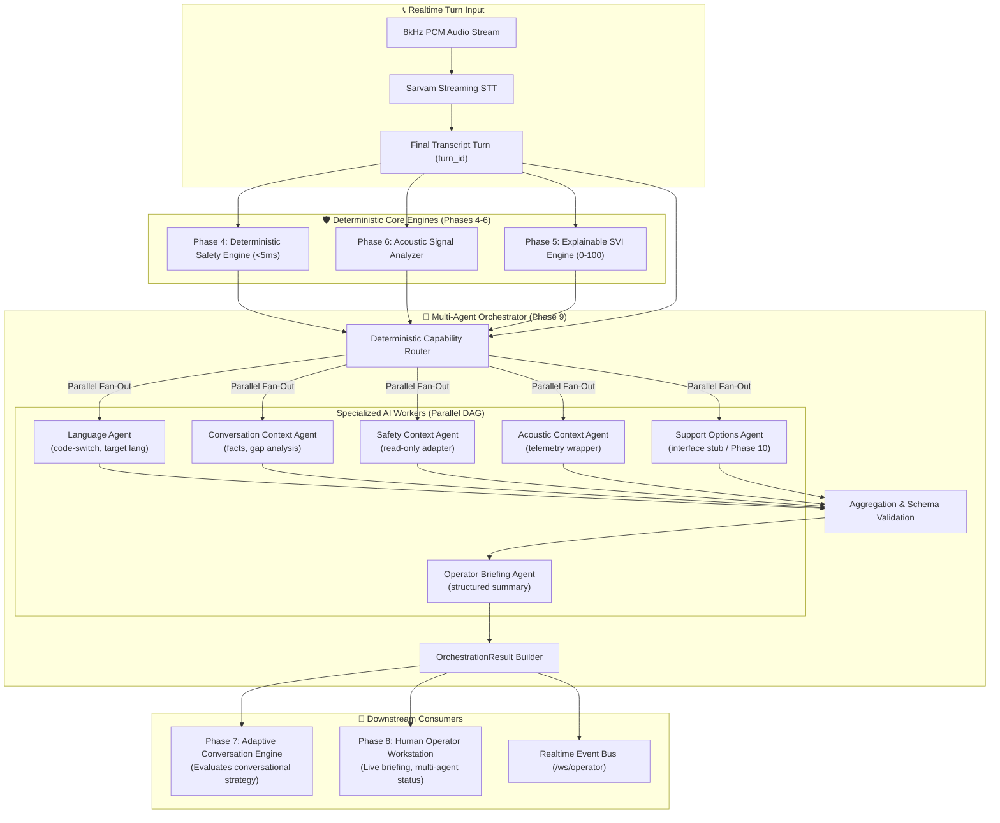

# SAMVED Phase 9 Architecture: Multi-Agent Orchestration & Specialized AI Coordination Layer

## 1. Purpose & Core Doctrine

SAMVED is an AI-assisted multilingual victim triage and response intelligence platform for the National Toll-Free Drug De-Addiction Helpline (**NHAA 14566**).

Phase 9 introduces the **Multi-Agent Orchestration Layer** to coordinate specialized AI sub-services/workers under a single deterministic, safety-constrained orchestration engine. 

### The Core Architectural Doctrine
```
Human Operator Authority + Deterministic Safety Engine (Inviolable)
                              ↓
                  Deterministic Orchestration Policy
                              ↓
                    Specialized AI Workers
                              ↓
                      Structured Outputs
                              ↓
                       Policy Validation
                              ↓
              Adaptive Conversation / Operator Console
```

### What Multi-Agent Means in SAMVED
SAMVED **never** deploys an uncontrolled swarm of autonomous agents that independently debate, talk in unbounded cycles, hallucinate emergency dispatches, or directly modify safety state. 

Instead, SAMVED implements **Specialized Workers**:
1. **Deterministic Adapters & Rule Workers**: Highly optimized, offline, sub-5ms deterministic modules (e.g., Safety Adapter, Acoustic Context Adapter).
2. **Context & Language Extractors**: Specialized tasks for fact extraction, language identification, and code-switch detection.
3. **Synthesis & Briefing Summarizers**: Consolidating multi-dimensional operational metrics into concise, structured human briefings.
4. **Placeholder / Interface Workers**: Providing standardized stubbed interfaces for future phases (e.g., Support Options Agent cleanly returning `NOT_AVAILABLE` until Phase 10 RAG is built).

All workers:
- Receive strictly bounded, least-privilege context.
- Execute within strict timeout envelopes.
- Return validated, typed, structured outputs with source evidence references.
- Are subordinate to the deterministic Safety Engine and human supervisor.

---

## 2. System Architecture & Turn Lifecycle



---

## 3. Specialized Agent Taxonomy & Capabilities (Initial Phase 9 Set)

| Agent Name | Agent Type | Capabilities | Timeout Budget | Safety Class | Primary Responsibility |
| :--- | :--- | :--- | :---: | :---: | :--- |
| **`safety_context`** | `DETERMINISTIC_ADAPTER` | `safety_packaging`, `threat_attribution` | 25ms | READ_ONLY_SAFETY | Packages deterministic Safety Engine assessments into unified orchestration schema. Never alters safety state. |
| **`acoustic_context`** | `DETERMINISTIC_ADAPTER` | `acoustic_packaging`, `quality_assessment` | 25ms | OPERATIONAL | Wraps Phase 6 acoustic metrics (SNR, speech ratio, pauses, interruptions) into orchestration context. No psychological inference. |
| **`language_context`** | `RULE_WORKER` | `language_detection`, `codeswitch_tracking` | 50ms | OPERATIONAL | Analyzes caller transcript and STT metadata for language consistency, code-switching, and preferred response language. |
| **`conversation_context`**| `LLM_WORKER` / `RULE_WORKER` | `fact_extraction`, `gap_detection`, `contradiction_check` | 150ms | NON_CRITICAL | Extracts structured facts (`immediate_danger`, `location`, `support_domain`), tracks unresolved gaps, flags direct factual contradictions. |
| **`operator_briefing`** | `FORMATTER` / `SUMMARIZER` | `briefing_generation`, `triage_synthesis` | 100ms | ADVISORY | Synthesizes multi-engine metrics into concise, evidence-linked bullet points for tele-counselor display. |
| **`support_options`** | `INTERFACE_STUB` | `support_recommendation` | 25ms | PLACEHOLDER | Clean interface stub for Phase 10 statutory RAG. Returns `NOT_AVAILABLE` with status `NEEDS_KNOWLEDGE_BASE`. |

---

## 4. Agent Registry & Contract Specifications

### 4.1 Agent Specification (`AgentSpec`)
Every worker registered in `apps/api/app/orchestration/registry.py` defines:
```python
class AgentType(str, Enum):
    DETERMINISTIC_ADAPTER = "DETERMINISTIC_ADAPTER"
    RULE_WORKER = "RULE_WORKER"
    LLM_WORKER = "LLM_WORKER"
    FORMATTER = "FORMATTER"
    SUMMARIZER = "SUMMARIZER"
    INTERFACE_STUB = "INTERFACE_STUB"

class AgentSafetyClassification(str, Enum):
    READ_ONLY_SAFETY = "READ_ONLY_SAFETY"
    OPERATIONAL = "OPERATIONAL"
    ADVISORY = "ADVISORY"
    NON_CRITICAL = "NON_CRITICAL"
    PLACEHOLDER = "PLACEHOLDER"

class AgentTimeoutTier(str, Enum):
    REALTIME_CRITICAL = "REALTIME_CRITICAL"   # <= 50ms
    REALTIME_NORMAL = "REALTIME_NORMAL"       # <= 200ms
    BACKGROUND = "BACKGROUND"                 # <= 1000ms

class AgentSpec(BaseModel):
    name: str
    version: str
    agent_type: AgentType
    capabilities: List[str]
    timeout_tier: AgentTimeoutTier
    max_latency_ms: int
    safety_classification: AgentSafetyClassification
    requires_human_review: bool = False
    is_realtime_capable: bool = True
    enabled: bool = True
```

### 4.2 Standard Agent Request Contract (`AgentRequest`)
```python
class AgentRequest(BaseModel):
    request_id: str             # Unique orchestration UUID
    call_id: str                # Active call identifier
    turn_id: str                # Current turn identifier (e.g. utterance_id)
    task_type: str              # Requested capability task
    language: str               # Current session language
    deadline_ms: int            # Epoch deadline for execution
    relevant_context: Dict[str, Any] # Bounded, least-privilege context dictionary
    constraints: List[str]      # Operational restrictions
```

### 4.3 Standard Agent Response Contract (`AgentResponse`)
```python
class AgentStatus(str, Enum):
    SUCCESS = "SUCCESS"
    FAILED = "FAILED"
    TIMED_OUT = "TIMED_OUT"
    CANCELLED = "CANCELLED"
    DEGRADED = "DEGRADED"
    UNAVAILABLE = "UNAVAILABLE"

class AgentResponse(BaseModel):
    request_id: str
    call_id: str
    turn_id: str
    agent_name: str
    agent_version: str
    status: AgentStatus
    result: Dict[str, Any]
    confidence: float           # 0.0 to 1.0 source-level confidence
    evidence_refs: List[str]    # Explicit provenance tokens (e.g. "TURN_3", "RULE_THREAT_01")
    latency_ms: float
    warnings: List[str] = []
    produced_at: str            # ISO-8601 UTC
```

---

## 5. Execution Model, Timeouts & Lifecycle

### 5.1 Directed Acyclic Graph (DAG) Execution
The orchestrator schedules workers in explicit stages:
- **Stage 1 (Parallel Context Extraction)**: Independent agents execute concurrently:
  - `safety_context` (25ms)
  - `acoustic_context` (25ms)
  - `language_context` (50ms)
  - `conversation_context` (150ms)
  - `support_options` (25ms)
- **Stage 2 (Aggregation & Validation)**: Outputs are schema-validated and assembled into `ValidatedContext`.
- **Stage 3 (Synthesis)**:
  - `operator_briefing` runs with `ValidatedContext` (100ms).
- **Stage 4 (Final Synthesis & Event Emission)**:
  - Assemble `OrchestrationResult`, broadcast events over `/ws/operator`, and pass validated context to `adaptive_engine`.

Total execution budget: $\le 250\text{ms}$ total turn time, avoiding any delay to real-time audio playback.

### 5.2 Timeouts & Backpressure
1. **Timeouts**: Every worker task is wrapped in `asyncio.wait_for(timeout)`. If an agent times out, its state is marked `TIMED_OUT`, and default safe fallback context is substituted.
2. **Backpressure**: If a newer turn starts before the prior turn's orchestration completes, the prior `request_id` is immediately marked `CANCELLED`, suppressing stale events and preventing queue build-up.
3. **No Retry Storms**: Deterministic workers do not retry; LLM workers allow a single bounded retry only on transient connection errors, never on schema failures.

### 5.3 Stale Result Protection
Every agent response checks:
$$\text{response.turn\_id} == \text{orchestrator.active\_turn\_id} \quad \land \quad \text{response.call\_id} == \text{orchestrator.active\_call\_id}$$
If a caller interrupts (barge-in) or a new turn arrives, any in-flight agent responses matching older turn IDs are immediately discarded with a logged warning.

---

## 6. Output Validation & Conflict Resolution

### 6.1 Schema Validation
All agent outputs are validated against strict Pydantic schemas. If an LLM worker outputs invalid JSON or out-of-spec fields:
1. Parsing failure is logged.
2. The agent is marked `FAILED`.
3. Deterministic rule-based fallback values are injected.
4. The system transitions into `DEGRADED` orchestration mode without halting the call.

### 6.2 Conflict Resolution Hierarchy
When agents disagree, deterministic rules resolve conflicts:
1. **Safety Disagreements**:
   - **Rule**: The Phase 4 Deterministic Safety Engine is **inviolable**. No agent can lower a safety state or dismiss a safety signal.
   - If `conversation_context` claims "Caller is safe" while `safety_context` reports `CRITICAL` (e.g. from active threat rule), `CRITICAL` is authoritative and overrides any agent claims.
2. **Language Disagreements**:
   - **Priority 1**: Operator explicit override selection.
   - **Priority 2**: Authoritative session language state from speech recognition.
   - **Priority 3**: High-confidence `language_context` detection ($\ge 0.90$).
   - **Priority 4**: Default fallback language (`ta-IN` / `hi-IN` / `en-IN`).
3. **Fact Contradictions**:
   - Newer statements supersede older statements when verified with explicit textual evidence.

---

## 7. Realtime Event Contracts & UI Workstation Integration

### 7.1 New Event Types (`packages/schemas/src/events.ts`)
- `ORCHESTRATION_STARTED`: Emitted when turn orchestration begins.
- `ORCHESTRATION_COMPLETED`: Emitted when all agents have executed and outputs are validated.
- `ORCHESTRATION_DEGRADED`: Emitted when one or more optional agents fail/time out.
- `AGENT_STARTED`: Emitted when an individual worker task launches.
- `AGENT_COMPLETED`: Emitted when an individual worker task succeeds.
- `AGENT_FAILED`: Emitted when an individual worker fails schema or execution.
- `AGENT_TIMEOUT`: Emitted when an individual worker exceeds its latency budget.
- `AGENT_CANCELLED`: Emitted when an individual worker task is cancelled due to barge-in.
- `OPERATOR_BRIEFING_GENERATED`: Emitted when a fresh structured briefing is produced.

### 7.2 Human Operator Console (`apps/web/src/app/calls/page.tsx`)
The operator workstation incorporates:
1. **Multi-Agent Status Panel (`data-testid="multi-agent-panel"`)**:
   - Orchestrator status pill (`READY`, `RUNNING`, `DEGRADED`, `FAILED`).
   - Active worker list with execution status badges (✓ `SUCCESS`, ⏳ `RUNNING`, ⚠️ `DEGRADED`, ✕ `FAILED`).
   - Total orchestration latency gauge ($\text{ms}$).
   - Re-run / Refresh Orchestration button (`data-testid="refresh-orchestration-button"`).
2. **Operator Briefing Card (`data-testid="operator-briefing-card"`)**:
   - Multi-dimensional synthesized summary (Safety, SVI, Acoustic, Adaptive, Key Facts).
   - Provenance evidence tokens (`[Evidence: TURN_3, RULE_01]`).
3. **Agent Trace Timeline**:
   - Filterable timeline in right sidebar showing granular agent execution events.

---

## 8. REST API Suite (`apps/api/app/api/v1/orchestration.py`)

Mounted under `/v1/orchestration/`:
- `GET /status`: Overall orchestrator operational health, registered workers count, and active capabilities.
- `GET /agents`: Full registry catalog of all registered agent specifications, versions, timeouts, and safety classifications.
- `GET /calls/{call_id}`: Latest `OrchestrationResult` for a given call.
- `GET /calls/{call_id}/history`: Chronological history of turn orchestration results for a given call.
- `POST /calls/{call_id}/refresh`: Operator-initiated manual re-run of multi-agent orchestration for the active turn.
- `POST /plan`: Standalone simulation endpoint to test multi-agent routing, parallel execution, and conflict resolution with synthetic inputs.

---

## 9. Failure Modes & Safety Guarantees

| Failure Scenario | System Response | Safety Impact |
| :--- | :--- | :--- |
| **Optional agent fails (e.g. Briefing Agent)** | Fallback briefing generated from raw safety/SVI metrics; status marked `DEGRADED`. | None; call continues uninterrupted. |
| **Language agent times out** | Fallback to current session language; status marked `DEGRADED`. | None; safe default applied. |
| **Orchestrator completely crashes** | Hard deterministic fallback in `ConversationOrchestrator`: safety engine, SVI, and adaptive fallback templates run independently. | Zero safety degradation; human operator retains full control. |
| **Caller barge-in during execution** | In-flight worker tasks cancelled immediately; audio playback halted; state reset to `LISTENING`. | Caller speech is prioritized immediately. |
| **Agent attempts to alter safety state** | Rejected at schema and aggregator layer; safety engine assessment remains immutable. | Authoritative safety boundary preserved. |
