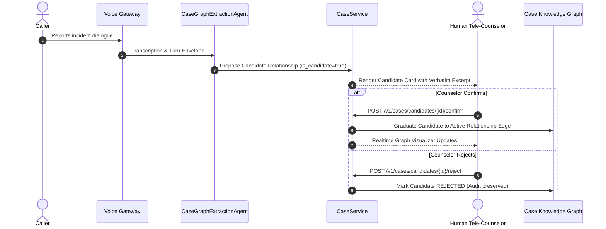

# SAMVED Case Intelligence & Knowledge Graph Runbook

This runbook covers operational procedures, entity and relationship lifecycle management, human counselor confirmation workflows, cryptographic provenance validation, and troubleshooting for SAMVED Phase 11: **Case Intelligence & Knowledge Graph — Explainable Entity/Relationship Layer**.

---

## 1. Subsystem Architecture & Philosophy

The SAMVED Case Intelligence Subsystem provides an evidence-linked, temporally aware, human-supervised case knowledge graph for caller triage and support prioritization under NHAA 14566.

### Non-Negotiable Boundaries:
1. **Epistemic Model**:
   - The graph models **reported dialogue and claims**, NOT objective ground truth, guilt, or legal culpability.
   - Nodes and edges carry explicit `claim_status` (`REPORTED`, `CORROBORATED`, `CONTESTED`, `SUPERSEDED`).
2. **Deterministic Safety Precedence**:
   - Phase 4 Safety Engine and Phase 5 SVI retain unconditional supremacy. Safety events are ingested as immutable, read-only evidence nodes (`SAFETY_SIGNAL`, `SVI_SIGNAL`).
3. **Zero Guilt Accusations**:
   - Punitive or criminal accusations (e.g. `OFFENDER`, `GUILTY`, `PERPETRATOR`) are strictly rejected or normalized to `REPORTED_ACTOR` with `claim_status = REPORTED`.
4. **Human Counselor Supervision**:
   - Automated entity and relationship extraction produces **Candidate Relationships** (`is_candidate = true`). Candidates do NOT graduate into active graph edges until confirmed by a licensed tele-counselor.
5. **Cryptographic Provenance**:
   - Every node and edge is cryptographically anchored by a SHA-256 hash of verbatim call dialogue excerpts with character/byte offsets.
6. **Temporal Non-Destructiveness**:
   - When new evidence conflicts with existing edges, the prior edge is **superseded** (`superseded_by`), preserving historical audit records and temporal validity intervals.
7. **Zero Autonomous Dispatch**:
   - The knowledge graph never initiates autonomous police calls, emergency dispatch, or external agency transmissions.

---

## 2. Entity & Relationship Schemas

### 2.1 Entity Types (`EntityType`)
- `PERSON`: Callers, family members, roommates, mentors, reported actors.
- `LOCATION`: Residence, campus, hostel, workplace, clinic, police station.
- `ORGANIZATION`: Universities, colleges, employers, NGOs, legal aid centers.
- `DOCUMENT`: ID cards, complaint filings, medical reports, certificates.
- `SERVICE`: Helplines, shelters, mental health clinics, legal assistance.
- `INCIDENT`: Reported occurrences, disputes, harassment claims, safety alerts.
- `SAFETY_SIGNAL`: Read-only evidence nodes linking Phase 4 deterministic safety triggers.
- `SVI_SIGNAL`: Read-only evidence nodes linking Phase 5 stress vulnerability assessments.

### 2.2 Person Roles (`PersonRole`)
- `CALLER`: The primary individual on the helpline call.
- `FAMILY_MEMBER`: Parents, siblings, spouse, children.
- `PEER_STUDENT`: Classmates, batchmates, friends.
- `INSTITUTIONAL_STAFF`: Wardens, professors, counselors, administrators.
- `REPORTED_ACTOR`: Any individual reported by caller in connection with an incident (neutral terminology).
- `SUPPORT_PERSON`: Advocates, trusted companions, social workers.

### 2.3 Relationship Types (`RelationshipType`)
- `FAMILY_OF`, `ENROLLED_AT`, `RESIDES_AT`, `EMPLOYED_BY`, `REPORTED_INVOLVEMENT_WITH`, `SEEKING_ASSISTANCE_FROM`, `WITNESSED_BY`, `CONNECTED_TO`, `SUPERSEDES`.

---

## 3. Human Tele-Counselor Workflow



### Confirmation Step:
When a tele-counselor clicks **Confirm** in the Case Intelligence panel:
1. Candidate relationship state changes to `CONFIRMED`.
2. A new active `CaseRelationship` is created in `case_relationships` table.
3. A `CASE_RELATIONSHIP_CREATED` event is appended to the case timeline.
4. An immutable audit record is committed to `case_merge_operations`.
5. WebSocket broadcast notifies the Operator Workstation.

---

## 4. REST API Reference

### 4.1 Subsystem Status
```bash
curl -X GET http://localhost:8000/v1/cases/status
```
Response:
```json
{
  "subsystem": "case_intelligence",
  "status": "ready",
  "active_cases": 1,
  "total_entities": 4,
  "total_relationships": 3,
  "total_candidates": 1,
  "epistemic_disclaimer": "Case Intelligence reflects reported dialogue and evidence, not legal conclusions or guilt."
}
```

### 4.2 Query Case Subgraph
```bash
curl -X GET "http://localhost:8000/v1/cases/case-1001/graph?depth=2&include_candidates=true"
```

### 4.3 Confirm Candidate Relationship
```bash
curl -X POST http://localhost:8000/v1/cases/candidates/cand-1001/confirm \
  -H "Content-Type: application/json" \
  -d '{"counselor_id": "counselor-42", "rationale": "Verified by caller in turn 6"}'
```

### 4.4 Reject Candidate Relationship
```bash
curl -X POST http://localhost:8000/v1/cases/candidates/cand-1001/reject \
  -H "Content-Type: application/json" \
  -d '{"counselor_id": "counselor-42", "reason": "Ambiguous reference, unverified"}'
```

### 4.5 Verify Graph Integrity
```bash
curl -X GET http://localhost:8000/v1/cases/case-1001/integrity
```
Returns:
- `dangling_edges`: Any edges referencing non-existent source/target entities.
- `temporal_anomalies`: Any edges where `valid_to < valid_from`.
- `corrupted_hashes`: Any evidence links whose SHA-256 hash does not match the excerpt text.

### 4.6 View Immutable Case Audit Trail
```bash
curl -X GET http://localhost:8000/v1/cases/case-1001/audit
```

---

## 5. Security & Safety Rules

1. **Prompt Injection Boundary**:
   - Extracted dialogue turns are wrapped in `<untrusted_dialogue>` XML tags. Extraction prompts treat dialogue strictly as inert data.
2. **Guilt Filtering Engine**:
   - The regex patterns reject assertions such as `"definitely guilty"`, `"is guilty"`, `"the perpetrator is"`, preventing biased or stigmatizing labels.
3. **Audit Immutability**:
   - Audit entries (`case_merge_operations`) cannot be updated or deleted via the REST API or UI.
