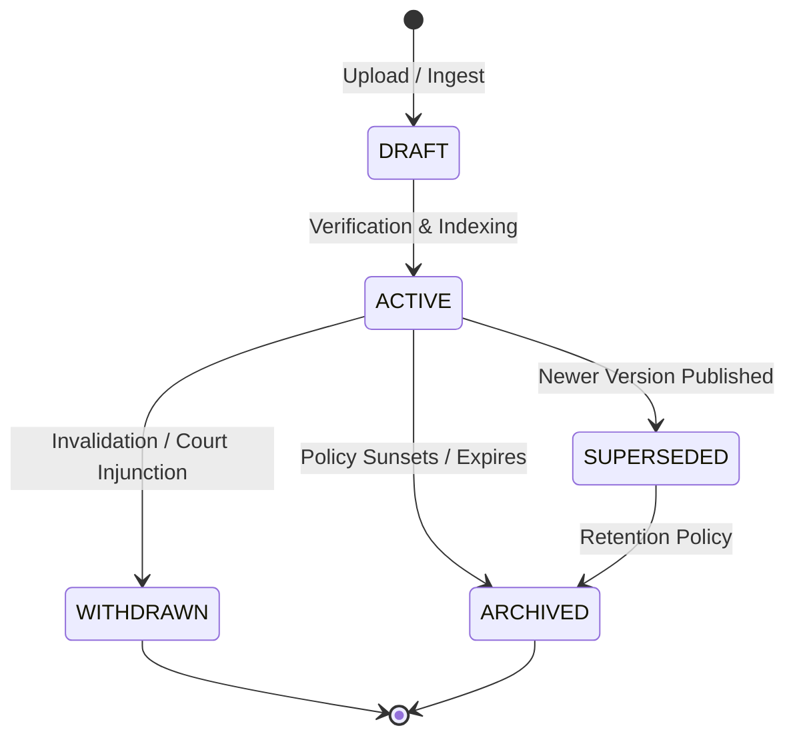

# SAMVED Knowledge Subsystem Runbook

This runbook covers operational procedures, document lifecycle management, ingestion workflows, citation integrity verification, and troubleshooting for SAMVED Phase 10: **Legal / Policy RAG — Governed, Citation-First Knowledge Retrieval**.

---

## 1. Subsystem Architecture & Philosophy

The SAMVED Knowledge Subsystem provides governed, citation-backed policy and legal guidance to human tele-counselors during active helpline sessions.

### Absolute Boundaries:
1. **Advisory Role**: The subsystem never issues binding legal determinations or triggers automatic police dispatch. Tele-counselors retain operational discretion.
2. **Safety Precedence**: Deterministic Safety Engine (Phase 4) signals always supersede knowledge retrieval advice.
3. **Zero Ungrounded Answers**: If no verified authoritative source matches a query under the specified jurisdiction and effective date, the subsystem yields `NO_RELIABLE_SOURCE_FOUND`. No LLM guesswork or parametric memory generation is permitted.

---

## 2. Source Registry & Authority Tiers

Documents ingested into SAMVED are assigned an **Authority Tier** that dictates retrieval reranking and statutory precedence:

| Tier | Name | Description | Example Sources |
| :---: | :--- | :--- | :--- |
| **Tier 1** | **Statutory / Gazetted** | Official gazette notifications, central acts, binding statutory rules, supreme court judgments. | Government of India Gazette, State Legislative Acts. |
| **Tier 2** | **Executive Departmental** | Departmental circulars, standard operating procedures (SOPs), ministerial guidelines. | Ministry of Women & Child Development SOPs, TN Health Dept Circulars. |
| **Tier 3** | **Institutional Best Practice** | Clinical triage protocols, vetted NGO helpline guidelines, NIMHANS crisis manuals. | National Health Mission guidelines, IASP protocols. |
| **Tier 4** | **General Information** | Informational portals, public press releases, verified institutional FAQs. | PIB releases, helpline informational summaries. |

---

## 3. Document Lifecycle & State Machine

Documents transition through a finite state machine to ensure outdated guidance is never presented as active law:



- **DRAFT**: Newly uploaded; pending checksum validation and contextual chunking.
- **ACTIVE**: Grounded in BM25 index; eligible for retrieval by operators and agents.
- **SUPERSEDED**: Replaced by a higher version (e.g., v1 replaced by v2). Retrievable only if `effective_only=false`. Generates `SOURCE MAY BE OUTDATED` warning banner.
- **ARCHIVED**: Surpassed retention period or repealed.
- **WITHDRAWN**: Quashed or rescinded by issuing authority; excluded from retrieval.

---

## 4. Ingestion Workflow

### 4.1 Ingestion Parameters
Ingestion is performed via `POST /v1/knowledge/ingest`:

```json
{
  "title": "Tamil Nadu Higher Education Welfare Scheme",
  "document_type": "STATE_GOVERNMENT_SCHEME",
  "publisher": "Department of Higher Education, Govt of Tamil Nadu",
  "authority_tier": 1,
  "jurisdiction": "TAMIL_NADU",
  "source_url": "https://tn.gov.in/schemes/welfare-2024",
  "raw_content": "# Welfare Scheme 2024\n\n## Section 1: Eligibility\n...",
  "version": "2.1",
  "effective_from": "2024-04-01T00:00:00Z",
  "effective_to": null,
  "supersedes_version": "1.0",
  "language": "en-IN"
}
```

### 4.2 Security Defenses During Ingestion
1. **SSRF Neutralization**:
   - Outgoing fetch requests validate the hostname and IP.
   - Connections to loopback addresses (`127.0.0.1`, `::1`), private ranges (`10.0.0.0/8`, `172.16.0.0/12`, `192.168.0.0/16`), and AWS metadata (`169.254.169.254`) are blocked.
2. **Size Enforcement**:
   - Maximum document size is capped at 10 MB. Payloads exceeding this limit receive HTTP 413.
3. **HTML / Script Sanitization**:
   - All text content is stripped of `<script>`, `<iframe>`, and malicious HTML entities before chunking.
4. **Prompt Injection Boundary**:
   - Context is injected into LLM prompt templates enclosed within `<retrieved_source_data>` XML delimiters. System instructions instruct the model to treat content within delimiters strictly as inert reference data.

---

## 5. Query & Retrieval Execution

### 5.1 REST Search Request
```bash
curl -X POST http://localhost:8000/v1/knowledge/search \
  -H "Content-Type: application/json" \
  -d '{
    "query": "scholarship eligibility criteria",
    "jurisdiction": "TAMIL_NADU",
    "language": "en-IN",
    "effective_only": true,
    "max_results": 5
  }'
```

### 5.2 Retrieval Scoring Pipeline
1. **Metadata Filtering**: Hard filter on jurisdiction (`CENTRAL` matches all; specific state matches that state) and language.
2. **BM25 Lexical Matching**: Tokenized query matched against normalized chunk bodies.
3. **Tier Weighting**: Tier 1 score multiplied by 1.25, Tier 2 by 1.10, Tier 3 by 1.00, Tier 4 by 0.85.
4. **Recency Decay**: Older versions penalized by $(1 - 0.05 \times \text{years\_old})$.
5. **Conflict Evaluation**: Overlapping provisions checked for contradictions. If Central and State disagree, conflict is flagged and Tier 1 / Central precedence is noted.

---

## 6. Operational Verification & Health Checks

### Check Knowledge Service Health
```bash
curl http://localhost:8000/v1/knowledge/status
```
Expected output:
```json
{
  "status": "HEALTHY",
  "corpus_size": 8,
  "active_documents": 8,
  "total_chunks": 18,
  "index_status": "READY",
  "last_ingestion": "2026-09-05T09:30:00Z"
}
```

### List Ingested Sources
```bash
curl http://localhost:8000/v1/knowledge/sources
```

### Inspect Citation Provenance
```bash
curl http://localhost:8000/v1/knowledge/citations/{citation_id}
```
Verifies cryptographic SHA-256 integrity of the verbatim excerpt against the stored document chunk.

---

## 7. Troubleshooting & FAQs

### Q: Why did search return `NO_RELIABLE_SOURCE_FOUND`?
1. The query keywords may have no overlap with the indexed corpus.
2. The document is present but expired (`effective_to < as_of_date`), and `effective_only` was set to `true`.
3. The document jurisdiction does not match the query jurisdiction filter.

### Q: How do I handle a `SOURCE_CONFLICT` alert?
1. Acknowledge the warning on the Operator Workstation.
2. Inspect the two conflicting citations displayed in the banner.
3. Apply standard legal conflict rules: Tier 1 statutory acts take precedence over Tier 2 departmental circulars; recent Central acts take statutory precedence unless a State enactment has received Presidential assent.
4. Counsel the caller based on the authoritative provision and record a structured note with `citation_ref`.
