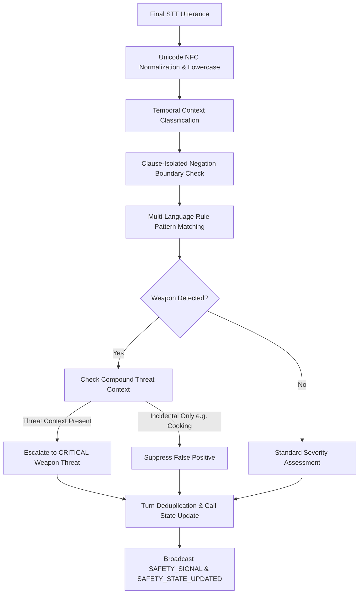

# SAMVED — Deterministic Realtime Safety Engine

## Overview & Architectural Principles

The **SAMVED Deterministic Realtime Safety Engine** is an offline, sub-5ms rule evaluation engine that continuously inspects speech-to-text turns and conversational events to detect acute threats, weapon presence, self-harm, forced confinement, and medical emergencies.

### Key Architectural Mandates
1. **The LLM is strictly NOT the safety authority**:
   - Safety decisions, severity escalations, and human-in-the-loop triggers are governed by deterministic, version-controlled pattern and rule logic.
   - The LLM cannot suppress, downgrade, or hallucinate safety assessments.
2. **Sub-5ms Determinism**:
   - Rule matching executes purely in-memory using compiled regex patterns with Unicode normalization (NFC) and word boundary constraints.
   - Benchmark latency on multi-turn conversations is consistently under 2 milliseconds per turn.
3. **Strict Ethical Boundaries**:
   - The engine does **NOT** attempt crime detection or legal guilt declaration.
   - The engine does **NOT** attempt psychiatric diagnosis or trauma profiling.
   - The engine does **NOT** execute automated police dispatch or autonomous law enforcement calls.
   - All high and critical signals mandate **Human-in-the-Loop Review** (`requires_human_review = True`).
4. **Immutable Audit Trail**:
   - Operator acknowledgments are appended as audit events (`SAFETY_SIGNAL_ACKNOWLEDGED`) with operator ID and timestamp.
   - Signals and evidence are never deleted or modified.

---

## Signal Taxonomy & Severity Levels

| Signal Type | Default Severity | Description | Triggers & Examples |
| :--- | :---: | :--- | :--- |
| `ONGOING_THREAT` | `HIGH` / `CRITICAL` | Active ongoing physical violence, immediate assault, or life threat | "He is hitting me", "Trying to break the door", "என்னை அடிக்கிறார்" |
| `WEAPON_PRESENCE` | `CRITICAL` | Threatening possession or brandishing of lethal weapons (knife, gun, blade, etc.) | "He has a knife and is breaking in", "उसके हाथ में चाकू है" |
| `SELF_HARM_CRISIS` | `CRITICAL` | Imminent suicidal ideation, intent, or self-harm emergency | "I want to end my life", "I have pills and cannot go on" |
| `CONFINEMENT` | `HIGH` | Physical restraint, locking inside rooms, or preventing exit | "Locked me inside the room and won't let me out" |
| `MEDICAL_EMERGENCY` | `HIGH` | Severe acute bleeding, unconsciousness, overdose, or respiratory arrest | "Severe bleeding", "Unconscious and not breathing" |
| `COERCION` | `ELEVATED` | Threats of exposure, extortion, or systemic intimidation | "Threatening to ruin my family if I tell anyone" |

---

## Processing Pipeline

### 1. Unicode Normalization
All input utterances are converted to Unicode Normalization Form C (`unicodedata.normalize("NFC", text)`) to guarantee identical byte representations for Indic diacritics and composite characters across platforms.

### 2. Clause-Isolated Negation Check
To eliminate false negations across complex multi-clause sentences, negation analysis is strictly bounded:
- Punctuation delimiters (`[,;.!?\n]`) act as clause boundaries.
- Negation detection looks within a maximum window of 5 words before and 3 words after the matched phrase within the same clause.
- Negation cues supported: `not`, `no`, `never`, `don't`, `does not`, `இல்லை`, `கிடையாது`, `नहीं`, `मत`.
- *Example*: In `"I cannot take this anymore, I want to end my life"`, the negation `"cannot"` in clause 1 does **not** bleed into clause 2.

### 3. Temporal Context Classification
- **`PRESENT`**: "now", "right now", "currently", "at the moment", "இப்போது", "இப்பவே", "अभी", "इस वक्त".
- **`PAST`**: "yesterday", "last night", "last week", "earlier", "நேற்று", "கடந்த வாரம்", "कल", "पहले".
- **`HYPOTHETICAL`**: "what if", "suppose", "if he", "ஒருவேளை", "अगर", "यदि".

### 4. Compound Escalation
Mentions of weapons alone (e.g. `"I am cutting vegetables with a knife in the kitchen"`) are classified as incidental and do not trigger a safety signal. However, when weapon mentions co-occur with threat verbs or assault indicators (e.g. `"He has a knife and is breaking the door"`), the signal is escalated to `CRITICAL` with `requires_human_review = True`.

---

## REST & WebSocket Integration

### REST Endpoints
- `GET /v1/safety/status`: Engine readiness, loaded rule count, version.
- `GET /v1/safety/rules`: Complete catalog of loaded deterministic safety rules.
- `POST /v1/safety/evaluate`: Test utterance against safety engine in real time.
- `GET /v1/safety/calls/{call_id}`: Retrieve active safety signals and current call safety state.
- `POST /v1/safety/calls/{call_id}/acknowledge`: Record operator acknowledgment with audit log.

### WebSocket Events
- `SAFETY_SIGNAL`: Dispatched immediately when a deterministic rule fires on an incoming utterance.
- `SAFETY_STATE_UPDATED`: Dispatched when the aggregate call safety state transitions (e.g. from `NORMAL` to `CRITICAL`).
- `SAFETY_SIGNAL_ACKNOWLEDGED`: Broadcast to all connected operator consoles when an alert is acknowledged.
