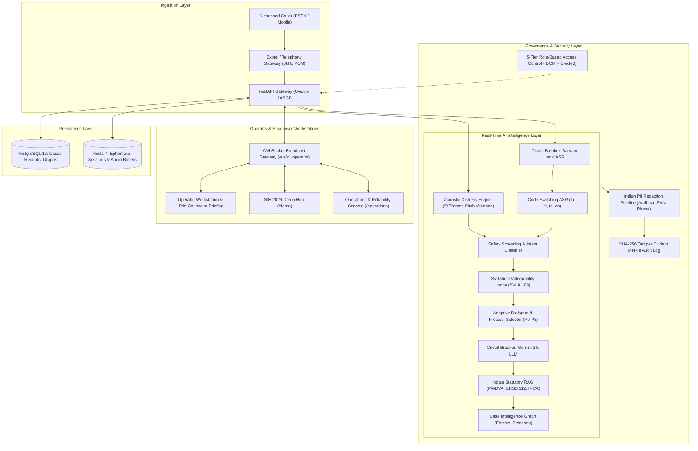
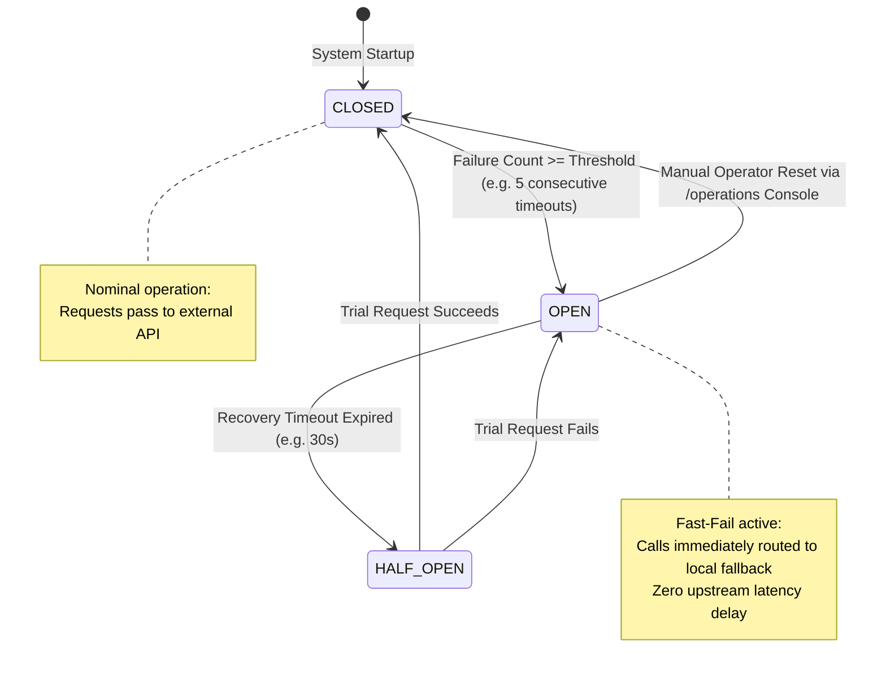

# SAMVED — System Architecture & Data Flow Topology

**Smart India Hackathon 2026 | PS-26093**  
**System Version:** `v1.0.0-sih2026`  
**Classification:** Enterprise Micro-Service System for Emergency Helpline Triage

---

## 1. High-Level System Architecture



---

## 2. 8-Stage Real-Time Pipeline Sequence

```mermaid
sequenceDiagram
    autonumber
    actor Caller as Caller
    participant Telephony as Telephony Subsystem
    participant STT as Sarvam Indic ASR
    participant Safety as Deterministic Safety Engine
    participant SVI as SVI Assessment Engine
    participant Adaptive as Adaptive Protocol Engine
    participant Copilot as Warm Transfer Copilot
    participant RAG as Statutory Knowledge RAG
    participant Graph as Case Intelligence Graph
    participant Audit as Cryptographic Audit Chain
    actor Operator as Human Tele-Counselor

    Caller->>Telephony: Speaks mixed Tamil/English duress utterance
    Telephony->>STT: Stream 8kHz audio frame
    STT->>Safety: Transcribed turn + Acoustic stress (0.94)
    Safety->>SVI: Flags IMMINENT_VIOLENCE, WEAPON_INVOLVED, INFANT_PRESENT
    SVI->>Adaptive: Computes SVI 88/100 (CRITICAL Band)
    Adaptive->>Copilot: Triggers Protocol P0 (Emergency Dispatch Assist)
    Copilot->>RAG: Synthesizes 3-point briefing; queries statutory protections
    RAG->>Graph: Injects PWDVA 2005 Sec 12 & ERSS 112 SOPs
    Graph->>Audit: Updates Case CASE-2026-SIH-001 entity relations
    Audit->>Operator: Computes SHA-256 Merkle hash; pushes live card via WebSocket
    Note over Operator: Operator inspects 3-point brief & verifies 112 dispatch
```

---

## 3. Circuit Breaker Fault Isolation Topology



---

## 4. Cryptographic Non-Repudiation Audit Chain

Every critical event is chained to ensure absolute evidentiary provenance:

$$\text{Block Hash}_n = \text{SHA-256}\Big(\text{Hash}_{n-1} \parallel \text{Timestamp} \parallel \text{Actor} \parallel \text{Action} \parallel \text{Resource} \parallel \text{Sanitized Payload}\Big)$$

If any historical record is altered in the PostgreSQL database, verifying the chain via `GET /v1/security/audit/verify` detects a hash mismatch at the modified block, guaranteeing non-repudiation for statutory authorities and courts.
